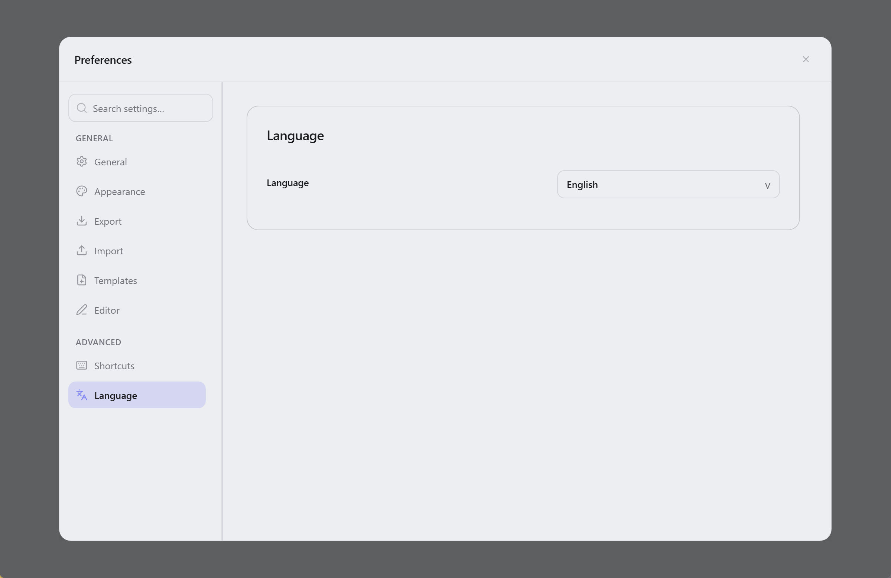

  

<h1 align="center">Lunote</h1>

  <strong>Open your Markdown folder—write, link, and explore a knowledge graph—with built-in tools and optional theme plugins.</strong> 
  <em>Free, open source, offline. Every note stays a plain <code>.md</code> file on your disk.</em> 
  <em>Your notes stay on your computer. No account, no upload—sync the folder yourself if you want.</em>

  Available for <strong>macOS</strong>, <strong>Windows</strong>, and <strong>Linux</strong>.

  
  
  
  

<h3 align="center">
  <a href="#preview">Screenshot</a> &nbsp;|&nbsp;
  <a href="#overview">What is Lunote</a> &nbsp;|&nbsp;
  <a href="#capabilities">Features</a> &nbsp;|&nbsp;
  <a href="#download">Download</a> &nbsp;|&nbsp;
  <a href="#development">Development</a> &nbsp;|&nbsp;
  <a href="#contribution">Contribution</a>
</h3>

  <strong>Docs:</strong> <a href="docs/README.md">All languages</a> · <a href="docs/README.zh-CN.md">简体中文</a>

  <strong>Translations:</strong>
  <a href="docs/README.zh-CN.md">🇨🇳</a>
  <a href="docs/README.zh-TW.md">🇹🇼</a>
  <a href="docs/README.ja.md">🇯🇵</a>
  <a href="docs/README.ko.md">🇰🇷</a>
  <a href="docs/README.de.md">🇩🇪</a>
  <a href="docs/README.fr.md">🇫🇷</a>
  <a href="docs/README.es.md">🇪🇸</a>
  <a href="docs/README.pt.md">🇵🇹</a>
  <a href="docs/README.it.md">🇮🇹</a>
  <a href="docs/README.ru.md">🇷🇺</a>

  <strong>Guide:</strong> <a href="docs/guide/themes.md">Themes</a> · <a href="docs/guide/shortcuts-and-menus.md">Shortcuts & slash (/) commands</a> · <a href="docs/guide/README.md">All guides</a>

  <strong>Typora-style writing + Obsidian-style linking — built in, plus a theme plugin catalog.</strong>

  
  
  

  <a href="#preview">Screenshot</a> · <a href="#overview">What is Lunote</a> · <a href="#capabilities">Features</a> · <a href="#download">Download</a> · <a href="#quick-start">Quick start</a> · <a href="#user-guide">User guide</a> · <a href="#faq">FAQ</a>

<!-- readme-demo-gif -->

  

Write · `[[wiki links]]` · backlinks · graph · export · themes · plugins

---

## Screenshot

  

| Code editor | Source view | Knowledge graph |
| :---: | :---: | :---: |
|  |  |  |

| Global search | History snapshots | Theme settings |
| :---: | :---: | :---: |
|  |  |  |

---

<!-- readme-body-start -->

## What is Lunote

Lunote is a **local-first** Markdown notes app for macOS, Windows, and Linux. Open any folder of **`.md` files** as your workspace to write, connect notes with `[[wiki links]]`, and explore backlinks and a knowledge graph—**no account required**; optional theme packs are available in **Preferences → Plugins**.

- Open any folder of **`.md` files** as your workspace
- **Visual and source** editing with one shortcut to switch modes
- Built-in **wiki links**, backlinks, graph, outline, and search
- **Preferences → Plugins**: browse theme packs (CSS, snippets, tokens) from the [lunote-theme](https://github.com/lunote-code/lunote-theme) catalog

| | |
|---|---|
| **Platforms** | macOS, Windows, Linux |
| **UI languages** | English, 简体中文, 繁體中文, 日本語, 한국어, Deutsch, Français, Español, Русский, Português (Brasil), Italiano |
| **Export** | PDF, Word (DOCX), HTML, PNG · print |

---

## Core features

Pick your workflow—these capabilities ship in the app:

### Write

*For essays, docs, and daily notes—you see formatted text or raw Markdown.*

- Visual editor and **Markdown source**; `Cmd+/` / `Ctrl+/` to switch
- **`/` slash menu** for headings, lists, tables, code, Mermaid, callouts, wiki links
- Tables, math, images, Mermaid, **focus mode**, Command Palette (`Cmd+Shift+P`)
- **Code blocks** with line numbers, syntax highlighting, language picker, fold, and copy
- **Formatting toolbar** (Callout, colors, etc.); hide via **File → Preferences → Typography**
- Adjust **reading column width**, font family, and font size in **Preferences → Typography**

### Link notes

*For a second brain: `[[links]]`, backlinks, and a graph—built in.*

- `[[wiki links]]` with autocomplete and safe navigation
- **Knowledge panel**: backlinks, local graph, embeds, tags, and **YAML frontmatter**
- Renaming a note updates `[[links]]` across the folder

### Organize

*When the vault grows: tabs, outline, and search across every note.*

- Sidebar file tree, tabs, and **global search** (`Cmd+Shift+F`)
- Per-note **outline** and external file change detection
- Save, conflict handling, reveal in file manager

### Export & look

*Share or print: PDF, Word, HTML—plus themes and optional plugin packs.*

- Export to **PDF, HTML, DOCX, PNG**; system **print**
- Light/dark themes, **Theme folder**, external CSS
- **Reading column width** presets (Narrow / Standard / Wide) for visual mode and preview
- **Preferences → Plugins**: install theme packs from the [lunote-theme](https://github.com/lunote-code/lunote-theme) catalog

### History

*Try bold edits—snapshots let you preview before saving to disk.*

- Per-note **snapshots**; restore to the editor without overwriting disk until you save

<!-- readme-body-end -->

---

## Download

**[Download latest release →](https://github.com/lunote-code/lunote/releases)**

No sign-up · local `.md` files only · works offline

<strong>macOS first launch (Gatekeeper)</strong>

1. Move **Lunote** to **Applications**
2. **Right-click → Open → Open**
3. If needed, run `xattr -cr /Applications/Lunote.app`

| Platform | Package |
|---|---|
| macOS (Apple Silicon) | `.dmg` (arm64) |
| Windows (x86_64) | `.msi` (x64) |
| Windows (ARM64) | `.msi` (arm64) |
| Linux (Debian/Ubuntu) | `.deb` (+ optional `.deb.asc`) |

---

## Quick start

1. **[Download](#download)** Lunote for your platform.
2. **Open your existing vault**—Obsidian, Logseq, Typora, or any folder of `.md` files. No import step.
3. Write, type `[[` to link notes, use `Cmd+Shift+F` / `Ctrl+Shift+F` to search, and export when you need PDF or Word.

> **Migrating?** Your files stay where they are. You can switch back to other tools anytime—they read the same Markdown.

---

## Why Lunote

- **Your files**: notes stay as normal `.md` in folders you control.
- **One app**: comfortable writing, wiki links, graph, and optional theme packs—core features work out of the box.

---

## How it compares

Already on Typora or Obsidian? Lunote is for people who want **comfortable writing and wiki links in one desktop app**, with optional theme packs when you want more.

| | Typora | Obsidian | Lunote |
|---|---|---|---|
| **Writing** | Excellent | Good | Excellent, built-in |
| **Wiki links & graph** | Limited | Strong (often via plugins) | Strong, built-in |
| **Plugins to get started** | Few | Many | **Optional** (theme catalog) |

## Why Lunote

- **Your files**: notes stay as normal `.md` in folders you control.
- **One app**: comfortable writing, wiki links, graph, and optional theme packs—core features work out of the box.

---

## How it compares

Already on Typora or Obsidian? Lunote is for people who want **comfortable writing and wiki links in one desktop app**, with optional theme packs when you want more.

| | Typora | Obsidian | Lunote |
|---|---|---|---|
| **Writing** | Excellent | Good | Excellent, built-in |
| **Wiki links & graph** | Limited | Strong (often via plugins) | Strong, built-in |
| **Plugins to get started** | Few | Many | **Optional** (theme catalog) |

## User guide

English how-to guides (themes, shortcuts, and the full **`/`** slash command list):

- [Themes](docs/guide/themes.md) — built-in themes, Theme folder, external CSS, snippets, export styles, **Preferences → Plugins** catalog
- [Shortcuts & quick menus](docs/guide/shortcuts-and-menus.md) — Command Palette, keyboard shortcuts, full **`/`** slash command list
- [Platform differences](docs/guide/platform-differences.md) — OS-specific PDF, print, reveal, and troubleshooting
- [Guide index](docs/guide/README.md) — all guide pages

---

## Development

If you wish to build Lunote yourself:

- **Prerequisites:** Node.js, Rust, and [Tauri](https://tauri.app/) platform tooling.
- **Dev:** `npm install` then `npm run tauri:dev`
- **Bundle:** `npm run tauri:bundle` (or `tauri:bundle:dmg` / `msi` / `deb`)
- **Docs:** [Documentation index](docs/README.md) · [Packaging](docs/packaging-strategy.md) · [Scripts](scripts/README.md)

Questions? [Open an issue](https://github.com/lunote-code/lunote/issues). Pull requests welcome.

---

## Contribution

Before a pull request:

- Read [Scripts & maintenance](scripts/README.md) for locale and release tooling
- Run `npm run lint` and relevant tests when touching editor or export code
- Keep messaging consistent across [localized READMEs](docs/README.md)

Ideas and migration stories: [Discussions](https://github.com/lunote-code/lunote/discussions) · [Issues](https://github.com/lunote-code/lunote/issues)

## FAQ

**Do I need an account or internet?**  
No. Lunote works offline. Notes stay local unless you sync the folder yourself (Git, Syncthing, iCloud Drive, etc.).

**Can I open my Obsidian or Typora folder?**  
Yes. Open the folder as your workspace—same `.md` files, no import.

**Can I use Lunote alongside Obsidian?**  
Yes. Both can point at the same folder. Lunote does not lock your data.

**Does it replace Obsidian or Notion entirely?**  
Not always. Lunote focuses on desktop writing + built-in linking. If you need mobile apps or a large plugin ecosystem, you may still pair other tools.

**Are there plugins?**  
Yes—for themes. Open **Preferences → Plugins** to browse packs from the [lunote-theme](https://github.com/lunote-code/lunote-theme) catalog (CSS, snippets, JSON tokens). Wiki links, graph, and export work without installing anything.

**How do I report bugs or share ideas?**  
[Open an issue](https://github.com/lunote-code/lunote/issues) or join a [discussion](https://github.com/lunote-code/lunote/discussions)—migration stories help others find Lunote.

---

## License

Open-source software. See the repository license file for terms.

---
