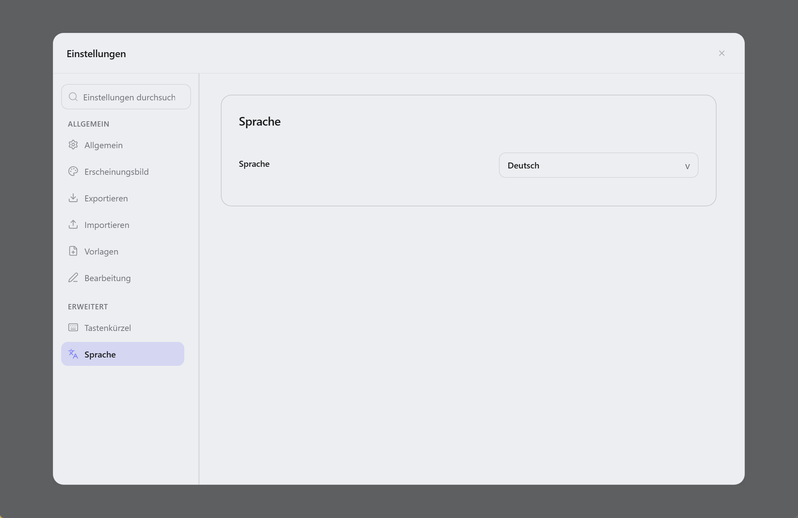

  

<h1 align="center">Lunote</h1>

  <strong>Markdown-Ordner öffnen—schreiben, verknüpfen, Wissensgraph erkunden. Kernfunktionen integriert, optionale Theme-Plugins.</strong> 
  <em>Kostenlos, Open Source, offline. Jede Notiz bleibt eine <code>.md</code>-Datei auf deiner Festplatte.</em> 
  <em>Notizen bleiben auf deinem Rechner. Kein Konto, kein Upload—Ordner bei Bedarf selbst synchronisieren (Git, Syncthing, iCloud usw.).</em>

  Verfügbar für <strong>macOS</strong>, <strong>Windows</strong> und <strong>Linux</strong>.

  
  
  
  

<h3 align="center">
  <a href="#preview">Screenshot</a> &nbsp;|&nbsp;
  <a href="#overview">Was ist Lunote</a> &nbsp;|&nbsp;
  <a href="#capabilities">Funktionen</a> &nbsp;|&nbsp;
  <a href="#download">Download</a> &nbsp;|&nbsp;
  <a href="#development">Entwicklung</a> &nbsp;|&nbsp;
  <a href="#contribution">Mitwirken</a>
</h3>

  <strong>Docs:</strong> <a href="README.md">All languages</a> · <a href="../README.md">English</a>

  <strong>Übersetzungen:</strong>
  <a href="../README.md">🇬🇧</a>
  <a href="README.zh-CN.md">🇨🇳</a>
  <a href="README.zh-TW.md">🇹🇼</a>
  <a href="README.ja.md">🇯🇵</a>
  <a href="README.ko.md">🇰🇷</a>
  <a href="README.fr.md">🇫🇷</a>
  <a href="README.es.md">🇪🇸</a>
  <a href="README.pt.md">🇵🇹</a>
  <a href="README.it.md">🇮🇹</a>
  <a href="README.ru.md">🇷🇺</a>

  <strong>Anleitung (Englisch):</strong> <a href="guide/themes.md">Design</a> · <a href="guide/shortcuts-and-menus.md">Shortcuts & <code>/</code>-Befehle</a> · <a href="guide/README.md">Übersicht</a>

  <strong>Typora-artiges Schreiben + Obsidian-artige Verknüpfung — eingebaut, mit Theme-Plugin-Katalog.</strong>

  
  
  

  <a href="#preview">Screenshot</a> · <a href="#overview">Was ist Lunote</a> · <a href="#capabilities">Funktionen</a> · <a href="#download">Download</a> · <a href="#quick-start">Schnellstart</a> · <a href="#user-guide">Anleitung</a> · <a href="#faq">FAQ</a>

<!-- readme-demo-gif -->

  

Schreiben · `[[Wiki-Links]]` · Backlinks · Graph · Export · Themes · Plugins

---

## Screenshot

  

| Code-Editor | Quelltext-Ansicht | Wissensgraph |
| :---: | :---: | :---: |
|  |  |  |

| Globale Suche | Verlaufs-Snapshots | Theme-Einstellungen |
| :---: | :---: | :---: |
|  |  |  |

---

<!-- readme-body-start -->

## Was ist Lunote

Lunote ist eine **local-first** Markdown-Notizen-App für macOS, Windows und Linux. Öffne einen **`.md`-Ordner** als Workspace, schreibe Notizen, verknüpfe sie mit `[[Wiki-Links]]` und nutze Backlinks sowie Wissensgraph—**ohne Konto**; optionale Theme-Packs findest du unter **Einstellungen → Plugins**.

- Beliebigen **`.md`-Ordner** als Workspace öffnen
- **Visuell und Quelle** per Tastenkürzel wechseln
- Integrierte **Wiki-Links**, Backlinks, Graph, Gliederung und Suche
- **Einstellungen → Plugins**: Theme-Packs (CSS, Snippets, Tokens) aus dem [lunote-theme](https://github.com/lunote-code/lunote-theme)-Katalog

| | |
|---|---|
| **Plattformen** | macOS, Windows, Linux |
| **Oberflächensprachen** | English, 简体中文, 繁體中文, 日本語, 한국어, Deutsch, Français, Español, Русский, Português (Brasil), Italiano |
| **Export** | PDF, Word (DOCX), HTML, PNG · print |

---

## Kernfunktionen

Wähle deinen Workflow—folgende Funktionen sind in Lunote integriert:

### Schreiben

*Für Essays, Docs und Tagesnotizen—formatiert oder als Markdown-Quelle.*

- Visueller Editor und **Markdown-Quelle**; `Cmd+/` / `Ctrl+/`
- **`/` Slash-Menü** für Blöcke, Tabellen, Mermaid, Wiki-Links
- Tabellen, Mathe, Bilder, **Fokusmodus**, Befehlspalette
- **Codeblöcke** mit Zeilennummern, Syntaxhervorhebung, Sprachwahl, Einklappen und Kopieren
- **Formatleiste** (Callout, Farben usw.); ausblenden unter **Ablage → Einstellungen → Typografie**
- **Lesespaltenbreite**, Schriftart und -größe unter **Einstellungen → Typografie**

### Verknüpfen

*Zweites Gehirn: `[[Links]]`, Backlinks und Graph—integriert.*

- `[[Wiki-Links]]` mit Autovervollständigung
- **Wissenspanel**: Backlinks, lokaler Graph, Einbettungen, Tags und **YAML-Frontmatter**
- Umbenennen aktualisiert `[[Links]]` im Ordner

### Organisieren

*Wenn der Vault wächst: Tabs, Gliederung und Suche in allen Notizen.*

- Dateibaum, Tabs, **globale Suche** (`Cmd+Shift+F`)
- **Gliederung** und Erkennung externer Änderungen
- Speichern, Konflikte, im Dateimanager anzeigen

### Export & Design

*Teilen oder drucken: PDF, Word, HTML—plus Themes und optionale Plugin-Packs.*

- **PDF, HTML, DOCX, PNG**; System**druck**
- Themes, **Theme-Ordner**, externes CSS
- **Lesespaltenbreite** (Schmal / Standard / Breit) für Visuell-Modus und Vorschau
- **Einstellungen → Plugins**: Theme-Packs aus dem [lunote-theme](https://github.com/lunote-code/lunote-theme)-Katalog installieren

### Verlauf

*Mutig editieren—Snapshots zeigen eine Vorschau, bevor du auf die Platte schreibst.*

- **Snapshots** pro Notiz; Wiederherstellen ohne sofortiges Überschreiben der Datei

<!-- readme-body-end -->

---

## Download

**[Neueste Version laden →](https://github.com/lunote-code/lunote/releases)**

Keine Anmeldung · nur lokale `.md`-Dateien · offline nutzbar

<strong>Erster Start unter macOS (Gatekeeper)</strong>

1. **Lunote** in **Programme** verschieben
2. **Rechtsklick → Öffnen → Öffnen**
3. Falls nötig: `xattr -cr /Applications/Lunote.app`

| Platform | Package |
|---|---|
| macOS (Apple Silicon) | `.dmg` (arm64) |
| Windows (x86_64) | `.msi` (x64) |
| Windows (ARM64) | `.msi` (arm64) |
| Linux (Debian/Ubuntu) | `.deb` (+ optional `.deb.asc`) |

---

## Schnellstart

1. Lunote unter **[Download](#download)** für dein System installieren.
2. **Bestehenden Vault öffnen**—Obsidian, Logseq, Typora oder jeden `.md`-Ordner. Kein Import.
3. Schreiben, `[[` für Links, `Cmd+Shift+F` / `Ctrl+Shift+F` zum Suchen, bei Bedarf nach PDF oder Word exportieren.

> **Umstieg?** Dateien bleiben am gleichen Ort. Andere Tools können dieselben Markdown-Dateien weiter nutzen.

---

## Warum Lunote

- **Deine Dateien**: normale `.md` in Ordnern, die du kontrollierst.
- **Eine App**: angenehm schreiben plus Wiki-Links und Graph—optionale Theme-Packs, Kernfunktionen sofort nutzbar.

---

## Im Vergleich

Nutzt du Typora oder Obsidian? Lunote ist für alle, die **Schreiben und Wiki-Links in einer Desktop-App** wollen—mit optionalem Theme-Katalog.

| | Typora | Obsidian | Lunote |
|---|---|---|---|
| **Schreiben** | Sehr gut | Gut | Sehr gut, integriert |
| **Wiki-Links & Graph** | Begrenzt | Stark (oft Plugins) | Stark, integriert |
| **Plugins zum Start** | Wenige | Viele | **Optional** (Theme-Katalog) |

---

## Anleitung (Englisch)

Englische Schritt-für-Schritt-Hilfe (Themes, Shortcuts und die vollständige **`/`**-Befehlsliste):

- [Themes](guide/themes.md) — integrierte Themes, Theme-Ordner, externes CSS, Snippets, Export-Stile, **Einstellungen → Plugins**-Katalog
- [Shortcuts & Schnellmenüs](guide/shortcuts-and-menus.md) — Command Palette, keyboard shortcuts, full **`/`** slash command list
- [Plattformunterschiede](guide/platform-differences.md) — OS-spezifisch: PDF, Druck, Anzeigen im Explorer und Fehlerbehebung
- [Anleitungsindex](guide/README.md) — all guide pages

---

## Entwicklung

Lunote selbst bauen:

- **Voraussetzungen:** Node.js, Rust und [Tauri](https://tauri.app/) Plattform-Tools
- **Dev:** `npm install`, dann `npm run tauri:dev`
- **Bundle:** `npm run tauri:bundle` (oder `tauri:bundle:dmg` / `msi` / `deb`)
- **Dokumentation:** [Dokumentationsindex](README.md) · [Packaging](packaging-strategy.md) · [Skripte](../scripts/README.md)

Fragen? [Issue eröffnen](https://github.com/lunote-code/lunote/issues). Pull Requests willkommen.

---

## Mitwirken

Vor einem Pull Request:

- [Skripte & Wartung](../scripts/README.md) für Locale- und Release-Tooling lesen
- Bei Editor- oder Export-Änderungen `npm run lint` und relevante Tests ausführen
- Produktionstexte über [lokalisierte READMEs](README.md) abstimmen

Ideen: [Discussions](https://github.com/lunote-code/lunote/discussions) · [Issues](https://github.com/lunote-code/lunote/issues)

## FAQ

**Konto oder Internet nötig?**  
Nein. Offline nutzbar; Notizen bleiben lokal, außer du synchronisierst den Ordner selbst.

**Obsidian- oder Typora-Ordner öffnen?**  
Ja. Ordner als Workspace öffnen—dieselben `.md`-Dateien.

**Parallel zu Obsidian nutzen?**  
Ja. Beide können denselben Ordner verwenden. Lunote sperrt deine Daten nicht.

**Ersetzt es Obsidian oder Notion vollständig?**  
Nicht immer. Fokus: Desktop-Schreiben + eingebaute Verknüpfung. Für Mobile oder große Plugin-Ökosysteme ggf. kombinieren.

**Feedback oder Ideen?**  
[Issue eröffnen](https://github.com/lunote-code/lunote/issues) oder [Discussion](https://github.com/lunote-code/lunote/discussions)—Umstiegsgeschichten helfen anderen.

---

## Lizenz

Open-Source-Software. Bedingungen siehe Lizenzdatei im Repository.

---
