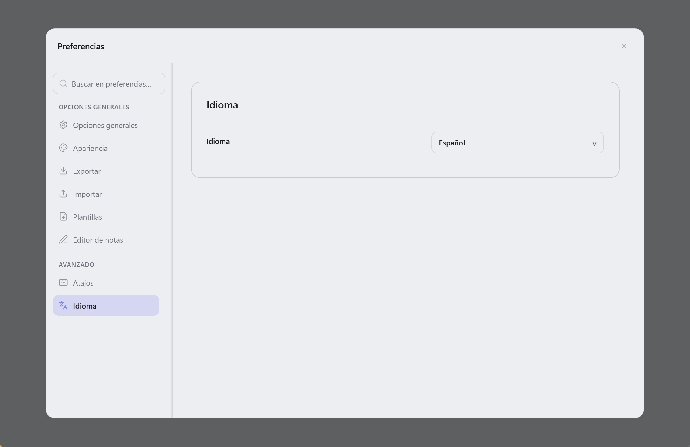

  

<h1 align="center">Lunote</h1>

  <strong>Abre tu carpeta Markdown—escribe, enlaza y explora un grafo. Herramientas integradas y plugins de tema opcionales.</strong> 
  <em>Gratis, código abierto, sin conexión. Cada nota es un <code>.md</code> en tu disco.</em> 
  <em>Las notas permanecen en tu equipo. Sin cuenta ni subida—sincroniza la carpeta tú mismo (Git, Syncthing, iCloud, etc.).</em>

  Disponible para <strong>macOS</strong>, <strong>Windows</strong> y <strong>Linux</strong>.

  
  
  
  

<h3 align="center">
  <a href="#preview">Captura</a> &nbsp;|&nbsp;
  <a href="#overview">Qué es Lunote</a> &nbsp;|&nbsp;
  <a href="#capabilities">Funciones</a> &nbsp;|&nbsp;
  <a href="#download">Descargar</a> &nbsp;|&nbsp;
  <a href="#development">Desarrollo</a> &nbsp;|&nbsp;
  <a href="#contribution">Contribuir</a>
</h3>

  <strong>Docs:</strong> <a href="README.md">All languages</a> · <a href="../README.md">English</a>

  <strong>Traducciones:</strong>
  <a href="../README.md">🇬🇧</a>
  <a href="README.zh-CN.md">🇨🇳</a>
  <a href="README.zh-TW.md">🇹🇼</a>
  <a href="README.ja.md">🇯🇵</a>
  <a href="README.ko.md">🇰🇷</a>
  <a href="README.de.md">🇩🇪</a>
  <a href="README.fr.md">🇫🇷</a>
  <a href="README.pt.md">🇵🇹</a>
  <a href="README.it.md">🇮🇹</a>
  <a href="README.ru.md">🇷🇺</a>

  <strong>Guía (inglés):</strong> <a href="guide/themes.md">Temas</a> · <a href="guide/shortcuts-and-menus.md">Atajos y comandos <code>/</code></a> · <a href="guide/README.md">Índice</a>

  <strong>Escritura al estilo Typora + enlaces al estilo Obsidian — integrado, con catálogo de plugins de tema.</strong>

  
  
  

  <a href="#preview">Captura</a> · <a href="#overview">Qué es Lunote</a> · <a href="#capabilities">Funciones</a> · <a href="#download">Descargar</a> · <a href="#quick-start">Inicio rápido</a> · <a href="#user-guide">Guía</a> · <a href="#faq">FAQ</a>

<!-- readme-demo-gif -->

  

Escribir · `[[enlaces wiki]]` · backlinks · grafo · exportar · temas · plugins

---

## Captura

  

| Editor de código | Vista de código fuente | Grafo de conocimiento |
| :---: | :---: | :---: |
|  |  |  |

| Búsqueda global | Instantáneas del historial | Ajustes de tema |
| :---: | :---: | :---: |
|  |  |  |

---

<!-- readme-body-start -->

## Qué es Lunote

Lunote es una aplicación de notas Markdown **local-first** para macOS, Windows y Linux. Abre una carpeta de **archivos `.md`** como espacio de trabajo para escribir, enlazar notas con `[[enlaces wiki]]` y explorar backlinks y grafo de conocimiento—**sin cuenta**; hay packs de temas opcionales en **Preferencias → Plugins**.

- Abre una **carpeta `.md`**
- **Visual y fuente** con un atajo
- **Enlaces wiki**, backlinks, grafo, esquema y búsqueda integrados
- **Preferencias → Plugins**: explorar packs de temas (CSS, snippets, tokens) del catálogo [lunote-theme](https://github.com/lunote-code/lunote-theme)

| | |
|---|---|
| **Plataformas** | macOS, Windows, Linux |
| **Idiomas de la interfaz** | English, 简体中文, 繁體中文, 日本語, 한국어, Deutsch, Français, Español, Русский, Português (Brasil), Italiano |
| **Exportar** | PDF, Word (DOCX), HTML, PNG · print |

---

## Funciones principales

Elige tu flujo—estas capacidades vienen integradas en Lunote:

### Escribir

*Ensayos, documentos y notas diarias—texto formateado o Markdown en bruto.*

- Editor visual y **fuente Markdown**; `Cmd+/` / `Ctrl+/`
- Menú **`/`** para bloques, tablas, Mermaid, enlaces wiki
- Tablas, matemáticas, imágenes, **modo enfoque**, paleta de comandos
- **Bloques de código** con números de línea, resaltado, idioma, plegado y copiar
- **Barra de formato** (callouts, colores, etc.); ocultar en **Archivo → Preferencias → Tipografía**
- **Ancho de columna**, fuente y tamaño en **Preferencias → Tipografía**

### Enlazar

*Segundo cerebro: `[[enlaces]]`, backlinks y grafo—integrados.*

- `[[enlaces wiki]]` con autocompletado
- **Panel de conocimiento**: backlinks, grafo local, incrustaciones, etiquetas y **frontmatter YAML**
- Renombrar actualiza los `[[enlaces]]`

### Organizar

*Cuando crece la biblioteca: pestañas, esquema y búsqueda en todas las notas.*

- Árbol de archivos, pestañas, **búsqueda global**
- **Esquema** y cambios externos
- Guardar, conflictos, mostrar en el gestor

### Exportar y tema

*Compartir o imprimir: PDF, Word, HTML—y temas o packs opcionales.*

- **PDF, HTML, DOCX, PNG** e **impresión**
- Temas, carpeta **Theme**, CSS externo
- Preajustes de **ancho de columna** (Estrecho / Estándar / Ancho) en modo visual y vista previa
- **Preferencias → Plugins**: instalar packs del catálogo [lunote-theme](https://github.com/lunote-code/lunote-theme)

### Historial

*Edita con confianza—las instantáneas previsualizan antes de guardar en disco.*

- **Instantáneas**; restaurar sin sobrescribir hasta guardar

<!-- readme-body-end -->

---

## Descargar

**[Descargar última versión →](https://github.com/lunote-code/lunote/releases)**

Sin registro · solo `.md` locales · funciona sin conexión

<strong>Primer inicio en macOS (Gatekeeper)</strong>

1. Mover **Lunote** a **Aplicaciones**
2. **Clic derecho → Abrir → Abrir**
3. Si hace falta: `xattr -cr /Applications/Lunote.app`

| Platform | Package |
|---|---|
| macOS (Apple Silicon) | `.dmg` (arm64) |
| Windows (x86_64) | `.msi` (x64) |
| Windows (ARM64) | `.msi` (arm64) |
| Linux (Debian/Ubuntu) | `.deb` (+ optional `.deb.asc`) |

---

## Inicio rápido

1. Instala Lunote desde **[Descargar](#download)**.
2. **Abre tu biblioteca existente**—Obsidian, Logseq, Typora o cualquier carpeta `.md`. Sin importar.
3. Escribe, usa `[[` para enlazar, `Cmd+Shift+F` / `Ctrl+Shift+F` para buscar, exporta a PDF o Word cuando quieras.

> **¿Migrando?** Los archivos siguen en su sitio. Otros programas pueden usar el mismo Markdown.

---

## Por qué Lunote

- **Tus archivos**: `.md` normales en carpetas que controlas.
- **Una sola app**: buena escritura, enlaces wiki y grafo integrados—packs de tema opcionales.

---

## Comparación

¿Usas Typora u Obsidian? Lunote es para quien quiere **escritura cómoda y enlaces wiki en una app de escritorio**, con catálogo de temas opcional.

| | Typora | Obsidian | Lunote |
|---|---|---|---|
| **Escritura** | Excelente | Buena | Excelente, integrada |
| **Enlaces wiki y grafo** | Limitado | Fuerte (a menudo plugins) | Fuerte, integrado |
| **Plugins al empezar** | Pocos | Muchos | **Opcionales** (catálogo) |

---

## Guía (inglés)

Ayuda paso a paso en inglés (temas, atajos y la lista completa de comandos **`/`**):

- [Temas](guide/themes.md) — temas integrados, carpeta Theme, CSS externo, snippets, estilos de exportación, catálogo **Preferencias → Plugins**
- [Atajos y menús rápidos](guide/shortcuts-and-menus.md) — Command Palette, keyboard shortcuts, full **`/`** slash command list
- [Diferencias por plataforma](guide/platform-differences.md) — PDF, impresión, revelar en el explorador y solución de problemas por SO
- [Índice de la guía](guide/README.md) — all guide pages

---

## Desarrollo

Compilar Lunote usted mismo:

- **Requisitos:** Node.js, Rust y herramientas de [Tauri](https://tauri.app/)
- **Dev:** `npm install` y luego `npm run tauri:dev`
- **Build:** `npm run tauri:bundle` (o `tauri:bundle:dmg` / `msi` / `deb`)
- **Docs:** [Índice de documentación](README.md) · [Packaging](packaging-strategy.md) · [Scripts](../scripts/README.md)

¿Preguntas? [Abrir un issue](https://github.com/lunote-code/lunote/issues). PR bienvenidos.

---

## Contribución

Antes de un pull request:

- Leer [Scripts y mantenimiento](../scripts/README.md) (locales y releases)
- Ejecutar `npm run lint` y pruebas relevantes al tocar editor o exportación
- Mantener coherencia en los [README localizados](README.md)

Ideas: [Discussions](https://github.com/lunote-code/lunote/discussions) · [Issues](https://github.com/lunote-code/lunote/issues)

## FAQ

**¿Cuenta o Internet?**  
No. Funciona sin conexión; notas locales salvo que sincronices la carpeta.

**¿Abrir carpeta de Obsidian o Typora?**  
Sí. Ábrela como espacio de trabajo—los mismos `.md`.

**¿Usar junto a Obsidian?**  
Sí. Ambos pueden usar la misma carpeta. Lunote no bloquea tus datos.

**¿Sustituye Obsidian o Notion?**  
No siempre. Enfoque: escritura en escritorio + enlaces integrados.

**¿Reportar errores o ideas?**  
[Abrir issue](https://github.com/lunote-code/lunote/issues) o [discusión](https://github.com/lunote-code/lunote/discussions).

---

## Licencia

Software de código abierto. Consulte el archivo de licencia del repositorio.

---
