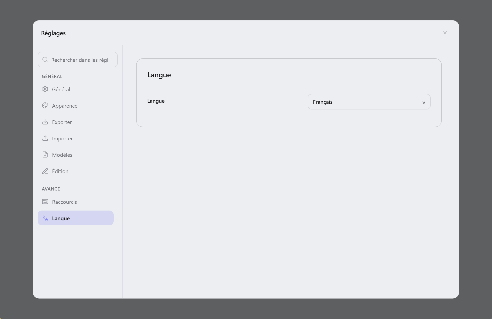

  

<h1 align="center">Lunote</h1>

  <strong>Ouvrez votre dossier Markdown—écrivez, reliez, explorez un graphe. Sans plugins.</strong> 
  <em>Gratuit, open source, hors ligne. Chaque note reste un fichier <code>.md</code> sur votre disque.</em> 
  <em>Les notes restent sur votre ordinateur. Pas de compte, pas d'envoi—synchronisez le dossier vous-même (Git, Syncthing, iCloud, etc.).</em>

  Disponible sur <strong>macOS</strong>, <strong>Windows</strong> et <strong>Linux</strong>.

  
  
  
  

<h3 align="center">
  <a href="#preview">Capture</a> &nbsp;|&nbsp;
  <a href="#overview">Présentation</a> &nbsp;|&nbsp;
  <a href="#capabilities">Fonctionnalités</a> &nbsp;|&nbsp;
  <a href="#download">Télécharger</a> &nbsp;|&nbsp;
  <a href="#development">Développement</a> &nbsp;|&nbsp;
  <a href="#contribution">Contribution</a>
</h3>

  <strong>Docs:</strong> <a href="README.md">All languages</a> · <a href="../README.md">English</a>

  <strong>Traductions :</strong>
  <a href="../README.md">🇬🇧</a>
  <a href="README.zh-CN.md">🇨🇳</a>
  <a href="README.zh-TW.md">🇹🇼</a>
  <a href="README.ja.md">🇯🇵</a>
  <a href="README.ko.md">🇰🇷</a>
  <a href="README.de.md">🇩🇪</a>
  <a href="README.es.md">🇪🇸</a>
  <a href="README.pt.md">🇵🇹</a>
  <a href="README.it.md">🇮🇹</a>
  <a href="README.ru.md">🇷🇺</a>

  <strong>Guide (anglais) :</strong> <a href="guide/themes.md">Thèmes</a> · <a href="guide/shortcuts-and-menus.md">Raccourcis & commandes <code>/</code></a> · <a href="guide/README.md">Index</a>

  <strong>Écriture façon Typora + liens façon Obsidian — intégré.</strong>

  
  
  

  <a href="#preview">Capture</a> · <a href="#overview">Présentation</a> · <a href="#capabilities">Fonctionnalités</a> · <a href="#download">Télécharger</a> · <a href="#quick-start">Démarrage rapide</a> · <a href="#user-guide">Guide</a> · <a href="#faq">FAQ</a>

<!-- readme-demo-gif -->

  

Écriture · `[[liens wiki]]` · backlinks · graphe · export · thèmes

---

## Capture

  

| Éditeur de code | Vue source | Graphe de connaissances |
| :---: | :---: | :---: |
|  |  |  |

| Recherche globale | Instantanés d'historique | Réglages du thème |
| :---: | :---: | :---: |
|  |  |  |

### Autres aperçus de thèmes

Captures supplémentaires : `assets/screenshots/theme/`. Fichiers CSS, jetons JSON et snippets prêts à l'emploi : **[Exemples de thèmes](theme-example/README.md)**.

| GitHub Light | GitHub Dark | IDEA Light | IDEA Dark | Dim Light |
| :---: | :---: | :---: | :---: | :---: |
|  |  |  |  |  |

| Dim Dark | Forest Dawn | Ember Glow | Graphite Noir | Lavender Haze |
| :---: | :---: | :---: | :---: | :---: |
|  |  |  |  |  |

---

<!-- readme-body-start -->

## Présentation

Ouvrez un dossier de **fichiers `.md`** et écrivez. Lunote ajoute `[[liens wiki]]`, backlinks et graphe—**sans compte ni boutique de plugins**.

- Ouvrir un **dossier `.md`** comme espace de travail
- **Visuel et source** en un raccourci
- **Liens wiki**, backlinks, graphe, plan et recherche intégrés

| | |
|---|---|
| **Plateformes** | macOS, Windows, Linux |
| **Langues de l'interface** | English, 简体中文, 繁體中文, 日本語, 한국어, Deutsch, Français, Español, Русский, Português (Brasil), Italiano |
| **Export** | PDF, Word (DOCX), HTML, PNG · print |

---

## Fonctions

Choisissez votre flux—tout ce qui suit est dans l'app :

### Rédiger

*Essais, docs, notes du jour—texte formaté ou Markdown brut.*

- Éditeur visuel et **source Markdown** ; `Cmd+/` / `Ctrl+/`
- Menu **`/`** : titres, listes, tableaux, Mermaid, liens wiki
- Tableaux, maths, images, **mode focus**, palette de commandes
- **Blocs de code** : numéros de ligne, coloration syntaxique, langue, repli et copie
- **Barre de formatage** (callouts, couleurs, etc.) ; masquable dans **Fichier → Préférences → Typographie**
- **Largeur de colonne**, police et taille dans **Préférences → Typographie**

### Relier

*Second cerveau : `[[liens]]`, backlinks et graphe sans plugins.*

- `[[liens wiki]]` avec autocomplétion
- **Panneau connaissance** : backlinks, graphe local, intégrations, tags et **frontmatter YAML**
- Renommage met à jour les `[[liens]]`

### Organiser

*Quand le coffre grossit : onglets, plan et recherche dans toutes les notes.*

- Arborescence, onglets, **recherche globale**
- **Plan** et détection des changements externes
- Sauvegarde, conflits, révéler dans le gestionnaire

### Export & apparence

*Partager ou imprimer : PDF, Word, HTML—et des thèmes que vous contrôlez.*

- **PDF, HTML, DOCX, PNG** ; **impression** système
- Thèmes, dossier **Theme**, CSS externe
- Préréglages de **largeur de colonne** (Étroit / Standard / Large) en mode visuel et aperçu

### Historique

*Éditez sans crainte—les snapshots prévisualisent avant d'écraser le disque.*

- **Instantanés** ; restauration sans écraser le disque avant sauvegarde

<!-- readme-body-end -->

---

## Télécharger

**[Télécharger la dernière version →](https://github.com/lunote-code/lunote/releases)**

Sans inscription · fichiers `.md` locaux · hors ligne

<strong>Premier lancement macOS (Gatekeeper)</strong>

1. Déplacer **Lunote** dans **Applications**
2. **Clic droit → Ouvrir → Ouvrir**
3. Si besoin : `xattr -cr /Applications/Lunote.app`

| Platform | Package |
|---|---|
| macOS (Apple Silicon) | `.dmg` (arm64) |
| Windows (x86_64) | `.msi` (x64) |
| Windows (ARM64) | `.msi` (arm64) |
| Linux (Debian/Ubuntu) | `.deb` (+ optional `.deb.asc`) |

---

## Démarrage rapide

1. Installer Lunote depuis **[Télécharger](#download)**.
2. **Ouvrir votre coffre existant**—Obsidian, Logseq, Typora ou tout dossier `.md`. Pas d'import.
3. Écrire, taper `[[` pour lier, `Cmd+Shift+F` / `Ctrl+Shift+F` pour chercher, exporter en PDF ou Word si besoin.

> **Migration ?** Les fichiers restent en place. D'autres outils peuvent lire le même Markdown.

---

## Pourquoi Lunote

- **Vos fichiers** : des `.md` normaux dans vos dossiers.
- **Une seule app** : écriture fluide, liens wiki et graphe intégrés—sans plugins.

---

## Comparatif

Sur Typora ou Obsidian ? Lunote est pour ceux qui veulent **écriture confortable et liens wiki dans une app bureau**, sans réglages de plugins.

| | Typora | Obsidian | Lunote |
|---|---|---|---|
| **Écriture** | Excellente | Bonne | Excellente, intégrée |
| **Liens wiki & graphe** | Limité | Fort (souvent plugins) | Fort, intégré |
| **Plugins au départ** | Peu | Beaucoup | Aucun |

---

## Guide (anglais)

Guides pratiques en anglais (thèmes, raccourcis et liste complète des commandes **`/`**) :

- [Thèmes](guide/themes.md) — built-in themes, Theme folder, external CSS, snippets, export styles
- [Raccourcis & menus rapides](guide/shortcuts-and-menus.md) — Command Palette, keyboard shortcuts, full **`/`** slash command list
- [Templates](Templates/README.md) — default and daily note templates, variables
- [Différences par plateforme](guide/platform-differences.md) — PDF, impression, révéler dans le gestionnaire de fichiers et dépannage par OS
- [Index du guide](guide/README.md) — all guide pages

---

## Développement

Construire Lunote vous-même :

- **Prérequis:** Node.js, Rust et outils [Tauri](https://tauri.app/)
- **Dev:** `npm install` puis `npm run tauri:dev`
- **Build:** `npm run tauri:bundle` (ou `tauri:bundle:dmg` / `msi` / `deb`)
- **Docs:** [Index documentation](README.md) · [Packaging](packaging-strategy.md) · [Scripts](../scripts/README.md)

Questions ? [Ouvrir une issue](https://github.com/lunote-code/lunote/issues). PR bienvenues.

---

## Contribution

Avant une pull request :

- Lire [Scripts & maintenance](../scripts/README.md) (locales et releases)
- Exécuter `npm run lint` et les tests pertinents pour l’éditeur ou l’export
- Harmoniser les textes via les [README localisés](README.md)

Idées : [Discussions](https://github.com/lunote-code/lunote/discussions) · [Issues](https://github.com/lunote-code/lunote/issues)

---

## FAQ

**Compte ou Internet requis ?**  
Non. Hors ligne ; notes locales sauf si vous synchronisez le dossier vous-même.

**Ouvrir un dossier Obsidian ou Typora ?**  
Oui. Ouvrez le dossier comme espace de travail—les mêmes fichiers `.md`.

**Utiliser avec Obsidian ?**  
Oui. Le même dossier pour les deux. Lunote ne verrouille pas vos données.

**Remplace Obsidian ou Notion ?**  
Pas toujours. Lunote vise l'écriture bureau + liens intégrés. Mobile ou grand écosystème de plugins : combinez si besoin.

**Signaler un bug ou une idée ?**  
[Ouvrir une issue](https://github.com/lunote-code/lunote/issues) ou une [discussion](https://github.com/lunote-code/lunote/discussions).

---

## Licence

Logiciel open source. Voir le fichier de licence du dépôt.

## Soutenir le projet

Si Lunote vous aide, vous pouvez soutenir volontairement le développement via **USDT TRC20** sur le réseau Tron.

| | |
|---|---|
| **Réseau** | Tron (TRC20) · USDT |
| **Adresse** | USDT · `TEDgPJzSmv7YTjrs2EZrFF5kCNbuZY15iY` |

Vérifiez l'adresse avant d'envoyer. Les transferts on-chain sont irréversibles. Le soutien est volontaire et ne constitue pas l'achat d'un service.

---