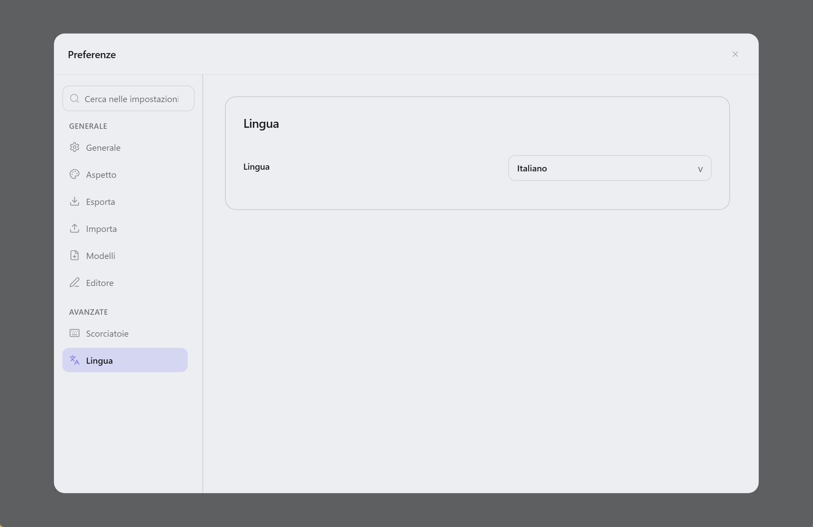

  

<h1 align="center">Lunote</h1>

  <strong>Apri la cartella Markdown—scrivi, collega ed esplora un grafo. Strumenti integrati e plugin tema opzionali.</strong> 
  <em>Gratuito, open source, offline. Ogni nota resta un file <code>.md</code> sul disco.</em> 
  <em>Le note restano sul computer. Nessun account, nessun upload—sincronizza la cartella tu (Git, Syncthing, iCloud, ecc.).</em>

  Disponibile per <strong>macOS</strong>, <strong>Windows</strong> e <strong>Linux</strong>.

  
  
  
  

<h3 align="center">
  <a href="#preview">Screenshot</a> &nbsp;|&nbsp;
  <a href="#overview">Panoramica</a> &nbsp;|&nbsp;
  <a href="#capabilities">Funzioni</a> &nbsp;|&nbsp;
  <a href="#download">Download</a> &nbsp;|&nbsp;
  <a href="#development">Sviluppo</a> &nbsp;|&nbsp;
  <a href="#contribution">Contribuire</a>
</h3>

  <strong>Docs:</strong> <a href="README.md">All languages</a> · <a href="../README.md">English</a>

  <strong>Traduzioni:</strong>
  <a href="../README.md">🇬🇧</a>
  <a href="README.zh-CN.md">🇨🇳</a>
  <a href="README.zh-TW.md">🇹🇼</a>
  <a href="README.ja.md">🇯🇵</a>
  <a href="README.ko.md">🇰🇷</a>
  <a href="README.de.md">🇩🇪</a>
  <a href="README.fr.md">🇫🇷</a>
  <a href="README.es.md">🇪🇸</a>
  <a href="README.pt.md">🇵🇹</a>
  <a href="README.ru.md">🇷🇺</a>

  <strong>Guida (inglese):</strong> <a href="guide/themes.md">Temi</a> · <a href="guide/shortcuts-and-menus.md">Scorciatoie & comandi <code>/</code></a> · <a href="guide/README.md">Indice</a>

  <strong>Scrittura stile Typora + collegamenti stile Obsidian — integrato, con catalogo plugin tema.</strong>

  
  
  

  <a href="#preview">Screenshot</a> · <a href="#overview">Panoramica</a> · <a href="#capabilities">Funzioni</a> · <a href="#download">Download</a> · <a href="#quick-start">Avvio rapido</a> · <a href="#user-guide">Guida</a> · <a href="#faq">FAQ</a>

<!-- readme-demo-gif -->

  

Scrivere · `[[wiki link]]` · backlink · grafo · export · temi · plugin

---

## Screenshot

  

| Editor di codice | Vista sorgente | Grafo della conoscenza |
| :---: | :---: | :---: |
|  |  |  |

| Ricerca globale | Snapshot cronologia | Impostazioni tema |
| :---: | :---: | :---: |
|  |  |  |

---

<!-- readme-body-start -->

## Panoramica

Apri una cartella di **file `.md`** e scrivi. Lunote aggiunge `[[wiki link]]`, backlink e grafo—**senza account; pack temi opzionali in Preferenze → Plugin**.

- Apri una **cartella `.md`**
- **Visuale e sorgente** con una scorciatoia
- **Wiki link**, backlink, grafo, outline e ricerca integrati
- **Preferenze → Plugin**: sfoglia pack temi (CSS, snippet, token) dal catalogo [lunote-theme](https://github.com/lunote-code/lunote-theme)

| | |
|---|---|
| **Piattaforme** | macOS, Windows, Linux |
| **Lingue dell'interfaccia** | English, 简体中文, 繁體中文, 日本語, 한국어, Deutsch, Français, Español, Русский, Português (Brasil), Italiano |
| **Export** | PDF, Word (DOCX), HTML, PNG · print |

---

## Funzioni

Scegli il tuo flusso—tutto quanto segue è nell'app:

### Scrivere

*Saggi, documenti e note quotidiane—testo formattato o Markdown grezzo.*

- Editor visuale e **sorgente Markdown**; `Cmd+/` / `Ctrl+/`
- Menu **`/`** per blocchi, tabelle, Mermaid, wiki link
- Tabelle, formule, immagini, **focus**, palette comandi
- **Blocchi di codice** con numeri di riga, evidenziazione, lingua, piega e copia
- **Barra di formattazione** (callout, colori, ecc.); nascondi in **File → Preferenze → Tipografia**
- **Larghezza colonna**, font e dimensione in **Preferenze → Tipografia**

### Collegare

*Secondo cervello: `[[collegamenti]]`, backlink e grafo—integrati.*

- `[[wiki link]]` con autocompletamento
- **Pannello conoscenza**: backlink, grafo locale, embed, tag e **frontmatter YAML**
- Rinomina aggiorna i `[[link]]`

### Organizzare

*Quando il vault cresce: schede, outline e ricerca in ogni nota.*

- Albero file, schede, **ricerca globale**
- **Outline** e modifiche esterne
- Salvataggio, conflitti, mostra nel file manager

### Export e aspetto

*Condividi o stampa: PDF, Word, HTML—più temi e pack opzionali.*

- **PDF, HTML, DOCX, PNG** e **stampa**
- Temi, cartella **Theme**, CSS esterno
- Preset **larghezza colonna** (Stretta / Standard / Larga) per modalità visuale e anteprima
- **Preferenze → Plugin**: installa pack dal catalogo [lunote-theme](https://github.com/lunote-code/lunote-theme)

### Cronologia

*Modifica con sicurezza—gli snapshot mostrano l'anteprima prima di salvare su disco.*

- **Snapshot**; ripristino senza sovrascrivere fino al salvataggio

<!-- readme-body-end -->

---

## Download

**[Scarica ultima versione →](https://github.com/lunote-code/lunote/releases)**

Nessuna registrazione · solo `.md` locali · offline

<strong>Primo avvio macOS (Gatekeeper)</strong>

1. Sposta **Lunote** in **Applicazioni**
2. **Tasto destro → Apri → Apri**
3. Se serve: `xattr -cr /Applications/Lunote.app`

| Platform | Package |
|---|---|
| macOS (Apple Silicon) | `.dmg` (arm64) |
| Windows (x86_64) | `.msi` (x64) |
| Windows (ARM64) | `.msi` (arm64) |
| Linux (Debian/Ubuntu) | `.deb` (+ optional `.deb.asc`) |

---

## Avvio rapido

1. Installa Lunote da **[Download](#download)**.
2. **Apri il vault esistente**—Obsidian, Logseq, Typora o qualsiasi cartella `.md`. Nessuna importazione.
3. Scrivi, digita `[[` per collegare, `Cmd+Shift+F` / `Ctrl+Shift+F` per cercare, esporta in PDF o Word quando serve.

> **Migrazione?** I file restano dove sono. Altri strumenti possono usare lo stesso Markdown.

---

## Perché Lunote

- **I tuoi file**: `.md` normali nelle cartelle che controlli.
- **Un'app sola**: scrittura comoda, wiki link e grafo integrati—pack opzionali.

---

## Confronto

Usi Typora o Obsidian? Lunote è per chi vuole **scrittura comoda e wiki link in un'app desktop**, con catalogo temi opzionale.

| | Typora | Obsidian | Lunote |
|---|---|---|---|
| **Scrittura** | Eccellente | Buona | Eccellente, integrata |
| **Wiki link e grafo** | Limitato | Forte (spesso plugin) | Forte, integrato |
| **Plugin per iniziare** | Pochi | Molti | **Opzionali** (catalogo) |

## Guida (inglese)

Guide pratiche in inglese (temi, scorciatoie ed elenco completo dei comandi **`/`**):

- [Temi](guide/themes.md) — temi integrati, cartella Theme, CSS esterno, snippet, stili export, catalogo **Preferenze → Plugin**
- [Scorciatoie e menu rapidi](guide/shortcuts-and-menus.md) — Command Palette, keyboard shortcuts, full **`/`** slash command list
- [Differenze tra piattaforme](guide/platform-differences.md) — PDF, stampa, mostra nel file manager e risoluzione problemi per OS
- [Indice guida](guide/README.md) — all guide pages

---

## Sviluppo

Compilare Lunote da soli:

- **Prerequisiti:** Node.js, Rust e tooling [Tauri](https://tauri.app/)
- **Dev:** `npm install` poi `npm run tauri:dev`
- **Build:** `npm run tauri:bundle` (o `tauri:bundle:dmg` / `msi` / `deb`)
- **Documentazione:** [Indice documentazione](README.md) · [Packaging](packaging-strategy.md) · [Script](../scripts/README.md)

Domande? [Apri un issue](https://github.com/lunote-code/lunote/issues). PR benvenute.

---

## Contribuire

Prima di una pull request:

- Leggere [Script e manutenzione](../scripts/README.md) (locale e release)
- Eseguire `npm run lint` e i test pertinenti per editor o export
- Allineare i testi nei [README localizzati](README.md)

Idee: [Discussions](https://github.com/lunote-code/lunote/discussions) · [Issues](https://github.com/lunote-code/lunote/issues)

## Sviluppo

Compilare Lunote da soli:

- **Prerequisiti:** Node.js, Rust e tooling [Tauri](https://tauri.app/)
- **Dev:** `npm install` poi `npm run tauri:dev`
- **Build:** `npm run tauri:bundle` (o `tauri:bundle:dmg` / `msi` / `deb`)
- **Documentazione:** [Indice documentazione](README.md) · [Packaging](packaging-strategy.md) · [Script](../scripts/README.md)

Domande? [Apri un issue](https://github.com/lunote-code/lunote/issues). PR benvenute.

---

## Contribuire

Prima di una pull request:

- Leggere [Script e manutenzione](../scripts/README.md) (locale e release)
- Eseguire `npm run lint` e i test pertinenti per editor o export
- Allineare i testi nei [README localizzati](README.md)

Idee: [Discussions](https://github.com/lunote-code/lunote/discussions) · [Issues](https://github.com/lunote-code/lunote/issues)

## Sviluppo

Compilare Lunote da soli:

- **Prerequisiti:** Node.js, Rust e tooling [Tauri](https://tauri.app/)
- **Dev:** `npm install` poi `npm run tauri:dev`
- **Build:** `npm run tauri:bundle` (o `tauri:bundle:dmg` / `msi` / `deb`)
- **Documentazione:** [Indice documentazione](README.md) · [Packaging](packaging-strategy.md) · [Script](../scripts/README.md)

Domande? [Apri un issue](https://github.com/lunote-code/lunote/issues). PR benvenute.

---

## Contribuire

Prima di una pull request:

- Leggere [Script e manutenzione](../scripts/README.md) (locale e release)
- Eseguire `npm run lint` e i test pertinenti per editor o export
- Allineare i testi nei [README localizzati](README.md)

Idee: [Discussions](https://github.com/lunote-code/lunote/discussions) · [Issues](https://github.com/lunote-code/lunote/issues)

## FAQ

**Serve account o Internet?**  
No. Funziona offline; note locali salvo sincronizzazione della cartella.

**Aprire cartella Obsidian o Typora?**  
Sì. Apri la cartella come workspace—stessi file `.md`.

**Usare insieme a Obsidian?**  
Sì. Stessa cartella per entrambi. Lunote non blocca i dati.

**Sostituisce Obsidian o Notion?**  
Non sempre. Focus: scrittura desktop + collegamenti integrati.

**Bug o idee?**  
[Apri issue](https://github.com/lunote-code/lunote/issues) o [discussion](https://github.com/lunote-code/lunote/discussions).

---

## Licenza

Software open source. Termini nel file di licenza del repository.

---
