

  

<h1 align="center">Lunote</h1>

  <strong>Markdown フォルダを開くだけ—執筆、リンク、ナレッジグラフ。プラグイン不要。</strong> 
  <em>無料・オープンソース・オフライン。ノートはディスク上の <code>.md</code> のまま。</em> 
  <em>ノートはあなたの PC に保存。アカウント不要・アップロードなし—必要なら Git / Syncthing / iCloud 等でフォルダ同期。</em>

  <strong>macOS</strong>、<strong>Windows</strong>、<strong>Linux</strong> に対応。

  
  
  
  

<h3 align="center">
  <a href="#preview">スクリーンショット</a> &nbsp;|&nbsp;
  <a href="#overview">概要</a> &nbsp;|&nbsp;
  <a href="#capabilities">機能</a> &nbsp;|&nbsp;
  <a href="#download">ダウンロード</a> &nbsp;|&nbsp;
  <a href="#development">開発</a> &nbsp;|&nbsp;
  <a href="#contribution">貢献</a>
</h3>

  <strong>Docs:</strong> <a href="README.md">All languages</a> · <a href="../README.md">English</a>

  <strong>翻訳:</strong>
  <a href="../README.md">🇬🇧</a>
  <a href="README.zh-CN.md">🇨🇳</a>
  <a href="README.zh-TW.md">🇹🇼</a>
  <a href="README.ko.md">🇰🇷</a>
  <a href="README.de.md">🇩🇪</a>
  <a href="README.fr.md">🇫🇷</a>
  <a href="README.es.md">🇪🇸</a>
  <a href="README.pt.md">🇵🇹</a>
  <a href="README.it.md">🇮🇹</a>
  <a href="README.ru.md">🇷🇺</a>

  <strong>ガイド（英語）:</strong> <a href="guide/themes.md">テーマ</a> · <a href="guide/shortcuts-and-menus.md">ショートカットと <code>/</code> コマンド</a> · <a href="guide/README.md">一覧</a>

  <strong>Typora 風の執筆 + Obsidian 風のリンク — 内蔵。</strong>

  
  
  

  <a href="#preview">スクリーンショット</a> · <a href="#overview">概要</a> · <a href="#capabilities">機能</a> · <a href="#download">ダウンロード</a> · <a href="#quick-start">クイックスタート</a> · <a href="#user-guide">ガイド</a> · <a href="#faq">FAQ</a>

<!-- readme-demo-gif -->

  

執筆 · `[[Wiki リンク]]` · バックリンク · グラフ · エクスポート · テーマ

---

## スクリーンショット

  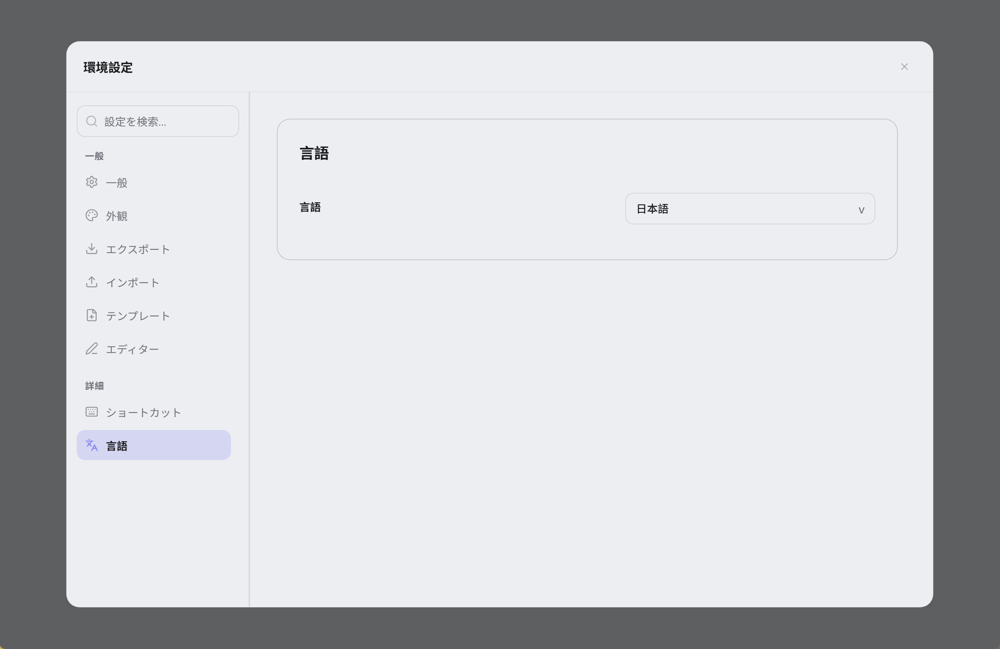

| コード編集 | ソース表示 | ナレッジグラフ |
| :---: | :---: | :---: |
|  |  |  |

| 全体検索 | 履歴スナップショット | テーマ設定 |
| :---: | :---: | :---: |
|  |  |  |

### その他のテーマプレビュー

追加の見た目スクショは `assets/screenshots/theme/`。テーマ例（CSS・トークン・スニペット）： **[テーマ例](theme-example/README.md)**.

| GitHub Light | GitHub Dark | IDEA Light | IDEA Dark | Dim Light |
| :---: | :---: | :---: | :---: | :---: |
| 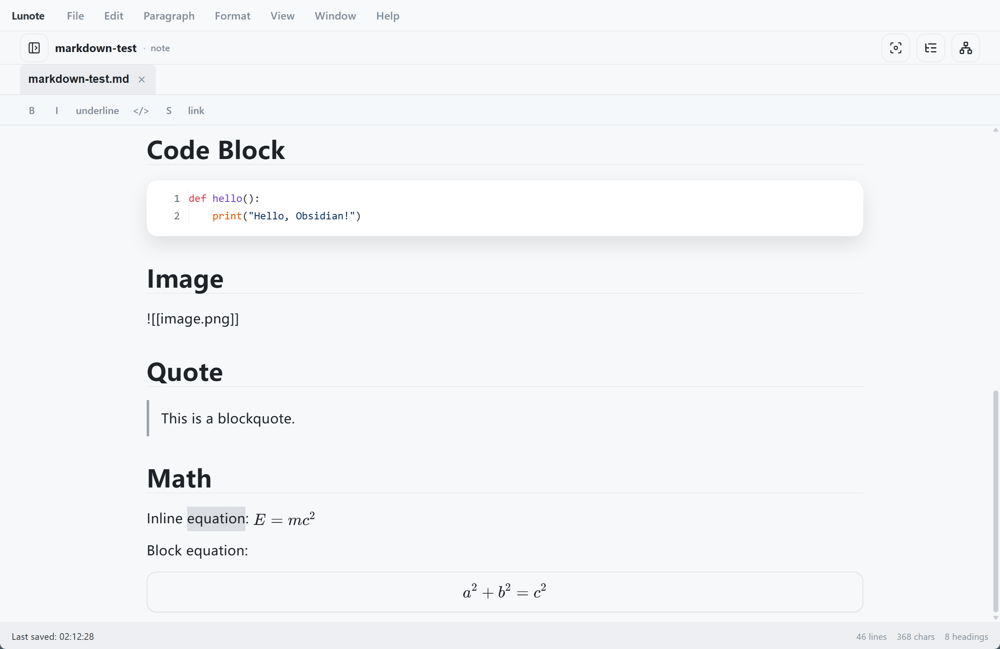 | 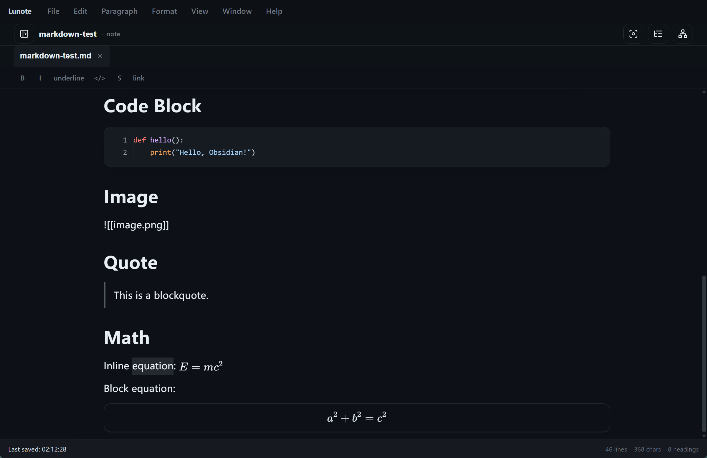 | 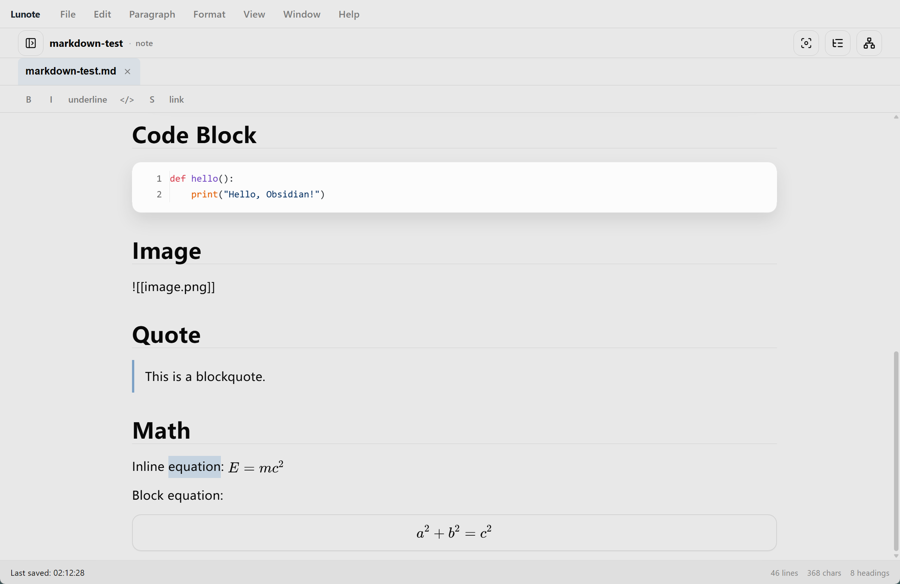 | 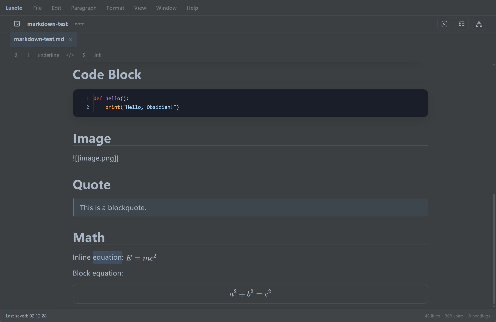 | 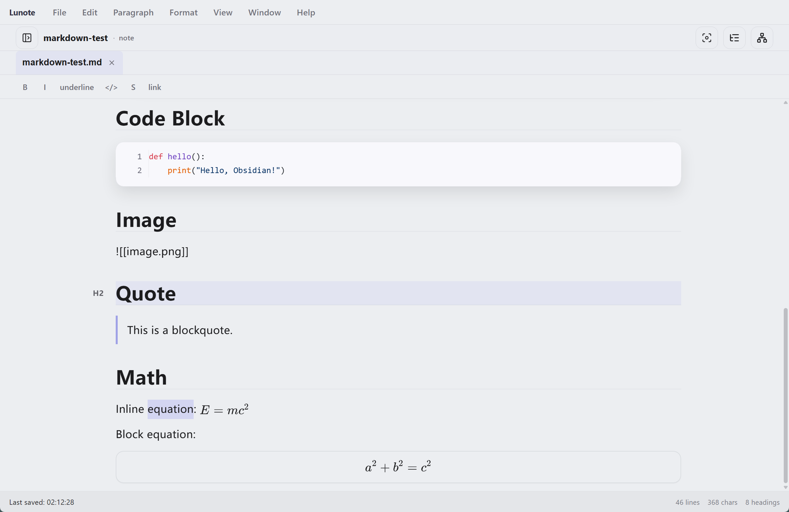 |

| Dim Dark | Forest Dawn | Ember Glow | Graphite Noir | Lavender Haze |
| :---: | :---: | :---: | :---: | :---: |
| 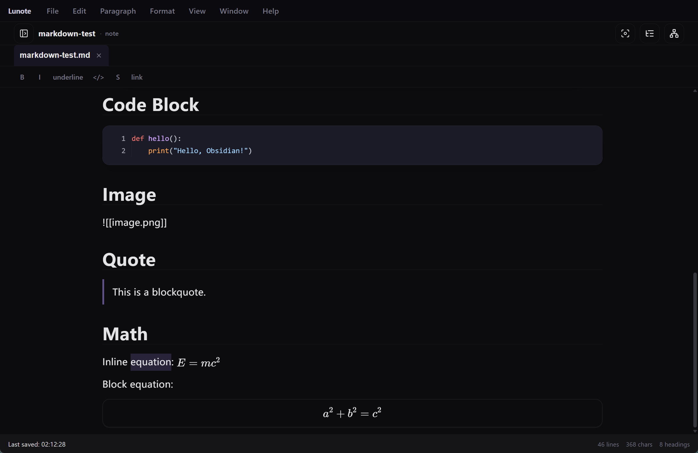 | 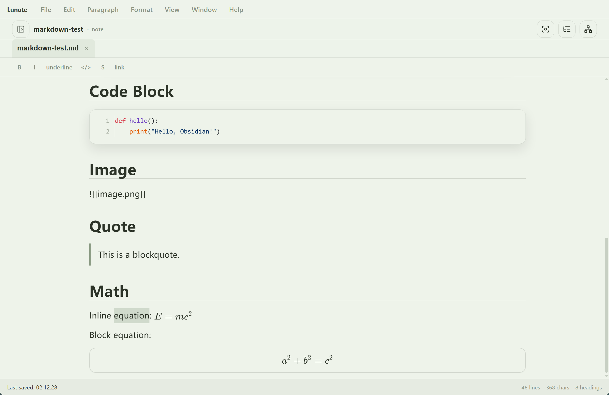 | 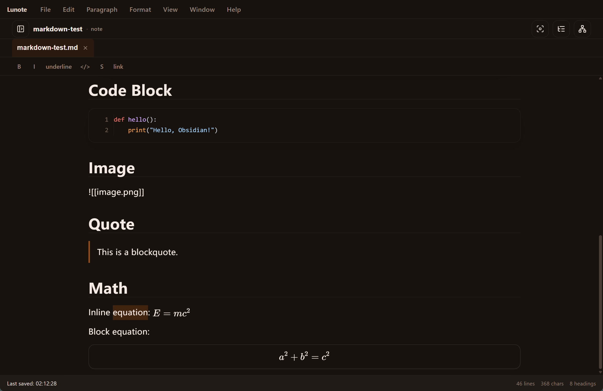 | 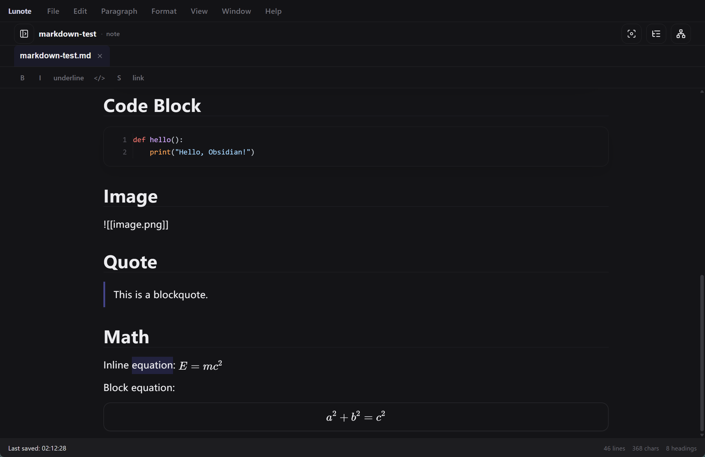 | 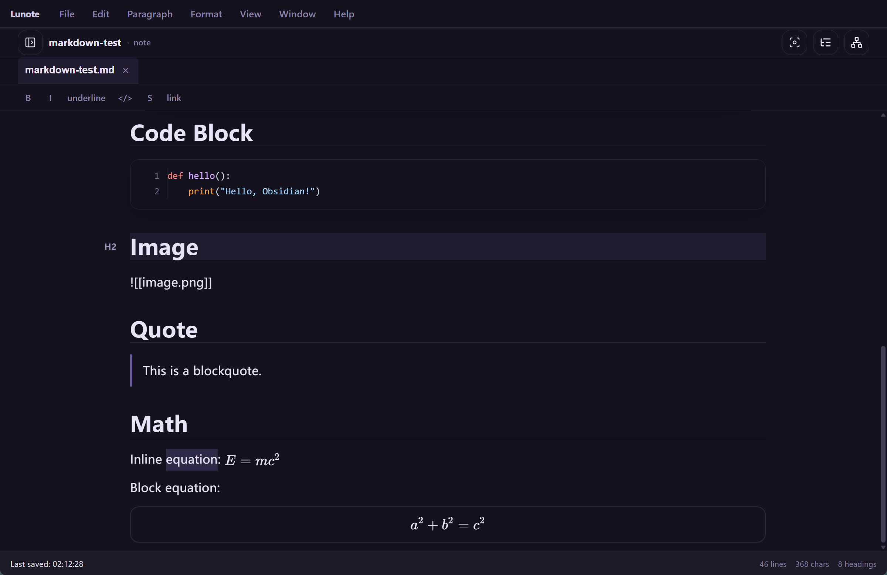 |

---

<!-- readme-body-start -->

## 概要

**`.md` フォルダ**を開いてすぐ執筆。`[[Wiki リンク]]`、バックリンク、グラフが内蔵—**アカウントもプラグインストアも不要**.

- 任意の **`.md` フォルダ**をワークスペースに
- **ビジュアルとソース**をショートカットで切替
- 内蔵の **Wiki リンク**、バックリンク、グラフ、アウトライン、検索

| | |
|---|---|
| **プラットフォーム** | macOS, Windows, Linux |
| **UI 言語** | English, 简体中文, 繁體中文, 日本語, 한국어, Deutsch, Français, Español, Русский, Português (Brasil), Italiano |
| **エクスポート** | PDF, Word (DOCX), HTML, PNG · print |

---

## 機能

ワークフローに合わせて—以下はすべてアプリに同梱：

### 執筆

*論文・ドキュメント・日記—整形表示と Markdown ソースを切り替え。*

- ビジュアル + **Markdown ソース**；`Cmd+/` / `Ctrl+/`
- **`/` メニュー**：見出し、表、Mermaid、Wiki リンク
- 表、数式、画像、**フォーカス**、コマンドパレット
- **コードブロック**：行番号、シンタックスハイライト、言語選択、折りたたみ、コピー
- **書式ツールバー**（コールアウト、色など）；**ファイル → 環境設定 → 組版** で非表示
- **読み取り欄幅**、フォント、サイズを **環境設定 → 組版** で調整

### リンク

*セカンドブレイン：`[[リンク]]`、バックリンク、グラフをプラグイン不要で。*

- `[[Wiki リンク]]` と補完
- **ナレッジパネル**：バックリンク、ローカルグラフ、埋め込み、タグ、**YAML frontmatter**
- リネームで `[[リンク]]` を更新

### 整理

*Vault が増えたら：タブ、アウトライン、全文検索。*

- ファイルツリー、タブ、**グローバル検索**
- **アウトライン**と外部変更の検出
- 保存、競合、ファイルマネージャで表示

### 出力と見た目

*共有・印刷：PDF、Word、HTML—テーマも自分で管理。*

- **PDF、HTML、DOCX、PNG**、**印刷**
- テーマ、**Theme フォルダ**、外部 CSS
- ビジュアルモードとプレビュー向け**読み取り欄幅**（狭 / 標準 / 広）

### 履歴

*大胆に編集—スナップショットでディスクに書く前にプレビュー。*

- **スナップショット**；保存前はディスクを上書きしない復元

<!-- readme-body-end -->

---

## ダウンロード

**[最新版をダウンロード →](https://github.com/lunote-code/lunote/releases)**

登録不要 · ローカル `.md` のみ · オフライン可

<strong>macOS 初回起動（Gatekeeper）</strong>

1. **Lunote** を **アプリケーション** に移動
2. **右クリック → 開く → 開く**
3. 必要なら `xattr -cr /Applications/Lunote.app`

| Platform | Package |
|---|---|
| macOS (Apple Silicon) | `.dmg` (arm64) |
| Windows (x86_64) | `.msi` (x64) |
| Windows (ARM64) | `.msi` (arm64) |
| Linux (Debian/Ubuntu) | `.deb` (+ optional `.deb.asc`) |

---

## クイックスタート

1. **[ダウンロード](#download)** からインストール。
2. **既存の Vault を開く**—Obsidian、Logseq、Typora または任意の `.md` フォルダ。インポート不要。
3. 執筆、`[[` でリンク、`Cmd+Shift+F` / `Ctrl+Shift+F` で検索、必要なら PDF / Word へエクスポート。

> **移行？** ファイルはそのまま。他ツールでも同じ Markdown を利用できます。

---

## Lunote を選ぶ理由

- **ファイルは手元に**：自分のフォルダの `.md`。
- **これ一つで**：書きやすさと Wiki リンク・グラフが内蔵—プラグイン設定不要。

---

## 他ツールとの比較

Typora や Obsidian をお使いですか？**快適な執筆と Wiki リンクを一つのデスクトップアプリで**求める方に Lunote。

| | Typora | Obsidian | Lunote |
|---|---|---|---|
| **執筆** | とても良い | 良い | とても良い・内蔵 |
| **Wiki リンクとグラフ** | 弱い | 強い（プラグイン多め） | 強い・内蔵 |
| **開始時のプラグイン** | 少ない | 多い | 不要 |

---

## ガイド（英語）

英語の使い方ガイド（テーマ、ショートカット、**`/`** スラッシュコマンド一覧）:

- [テーマ](guide/themes.md) — built-in themes, Theme folder, external CSS, snippets, export styles
- [ショートカットとクイックメニュー](guide/shortcuts-and-menus.md) — Command Palette, keyboard shortcuts, full **`/`** slash command list
- [Templates](Templates/README.md) — default and daily note templates, variables
- [プラットフォーム差](guide/platform-differences.md) — PDF、印刷、ファイルマネージャーでの表示、OS 別の注意
- [ガイド一覧](guide/README.md) — all guide pages

---

## 開発

Lunote を自分でビルドする場合：

- **環境:** Node.js、Rust、[Tauri](https://tauri.app/) のプラットフォームツール
- **開発:** `npm install` のあと `npm run tauri:dev`
- **ビルド:** `npm run tauri:bundle`（または `tauri:bundle:dmg` / `msi` / `deb`）
- **ドキュメント:** [ドキュメント索引](README.md) · [パッケージング](packaging-strategy.md) · [スクリプト](../scripts/README.md)

質問は [Issue](https://github.com/lunote-code/lunote/issues) へ。PR 歓迎します。

---

## 貢献

Pull request の前に：

- [スクリプトとメンテナンス](../scripts/README.md)（ロケール・リリース）を読む
- エディタやエクスポートを変更するときは `npm run lint` と関連テストを実行
- 文言は [各言語 README](README.md) で揃える

アイデア: [Discussions](https://github.com/lunote-code/lunote/discussions) · [Issues](https://github.com/lunote-code/lunote/issues)

---

## FAQ

**アカウントやネットは必要？**  
不要。オフライン利用可。フォルダは自分で同期するまでローカル。

**Obsidian / Typora のフォルダを開ける？**  
はい。ワークスペースとして開くだけ—同じ `.md`。

**Obsidian と併用できる？**  
はい。同じフォルダを指せます。データはロックされません。

**Obsidian / Notion の完全代替？**  
常にではありません。デスクトップ執筆と内蔵リンクに特化。

**フィードバックは？**  
[Issue](https://github.com/lunote-code/lunote/issues) または [Discussion](https://github.com/lunote-code/lunote/discussions)。

---

## ライセンス

オープンソースソフトウェア。条項はリポジトリのライセンスファイルを参照してください。

## プロジェクトを支援

Lunote が役に立った場合、Tron ネットワーク上の **TRC20 USDT** で開発を任意に支援できます。

| | |
|---|---|
| **ネットワーク** | Tron（TRC20）· USDT |
| **アドレス** | USDT · `TEDgPJzSmv7YTjrs2EZrFF5kCNbuZY15iY` |

送金前にアドレスを必ず確認してください。オンチェーン送金は取り消せません。支援は任意であり、サービスの購入を意味しません。

---