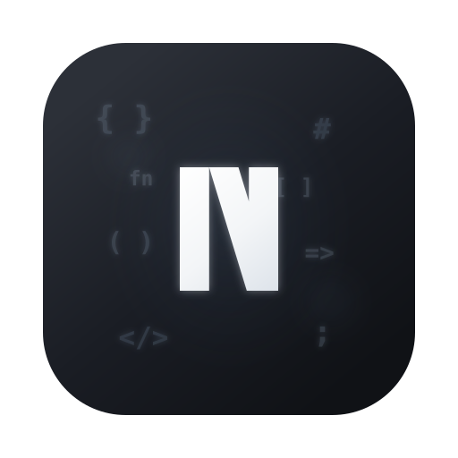
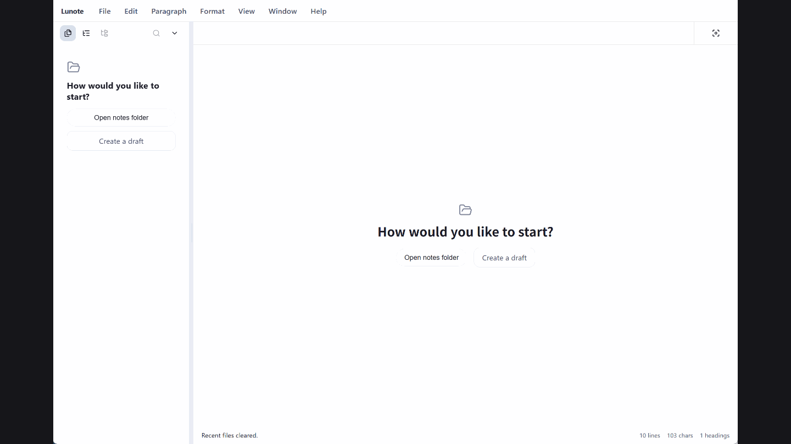
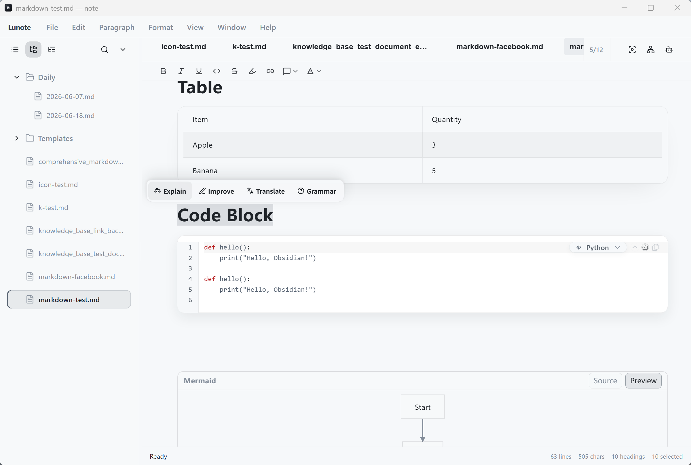
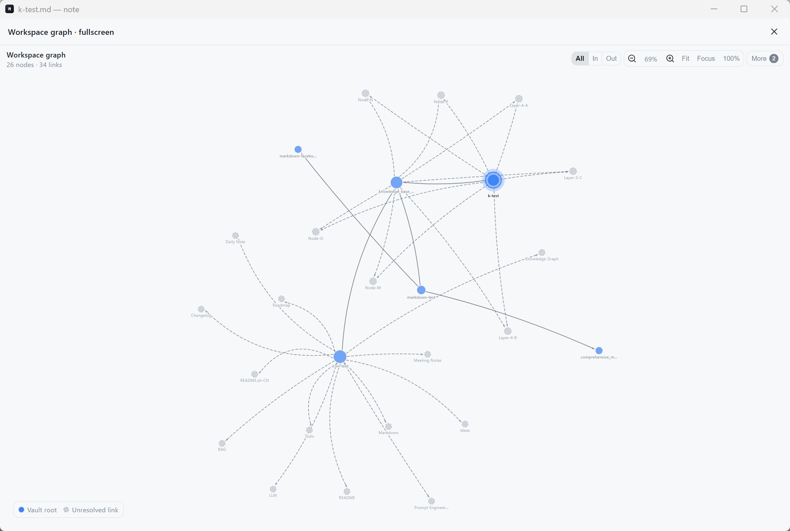
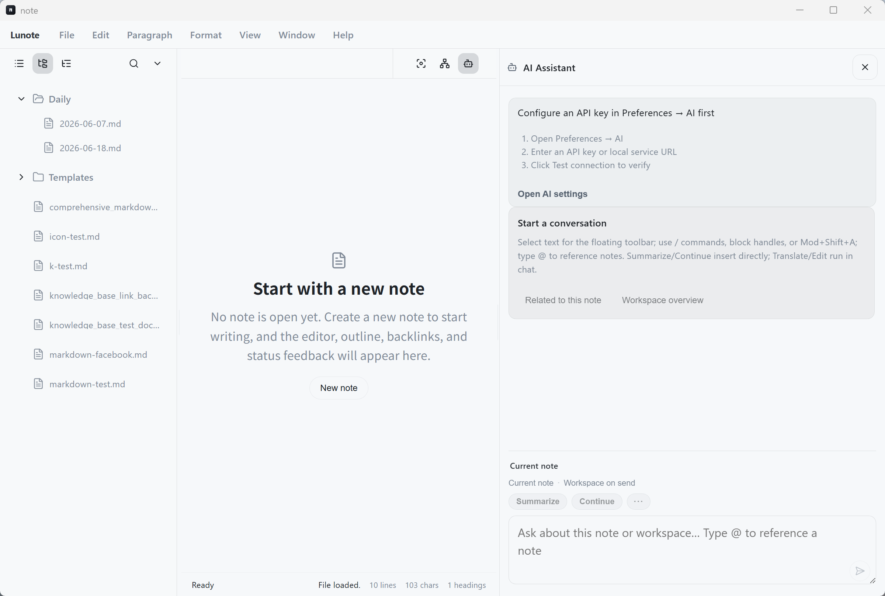
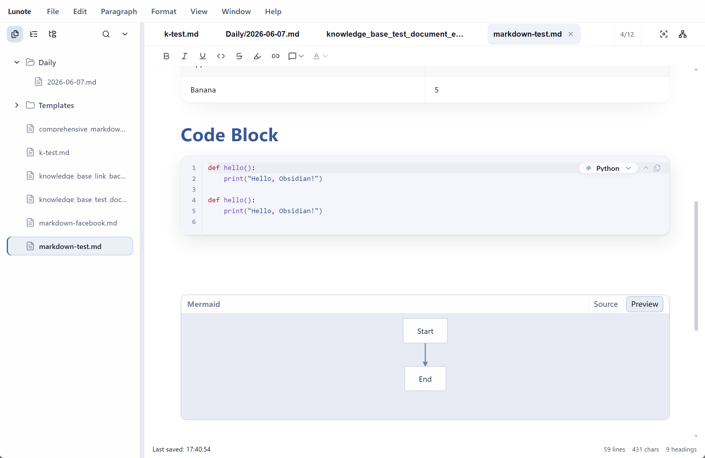
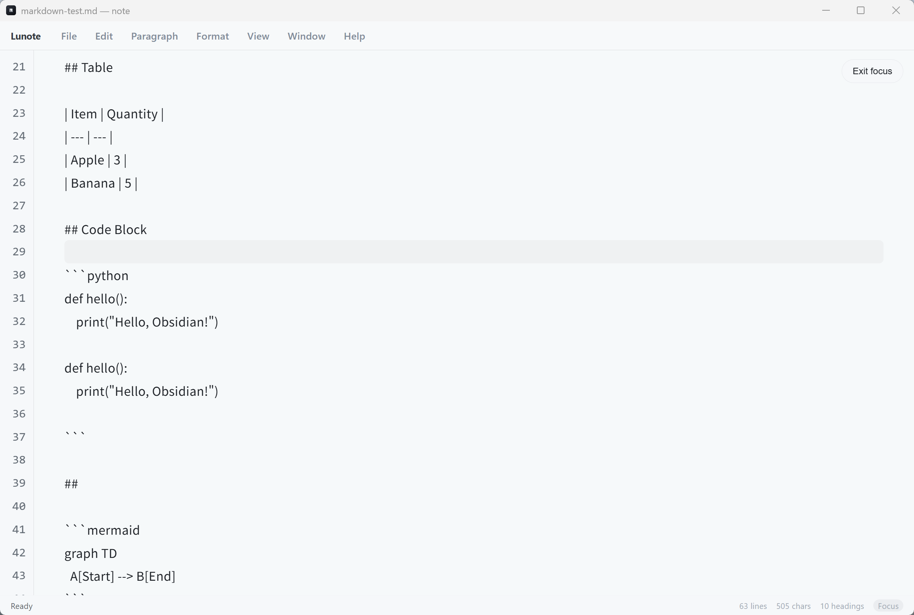
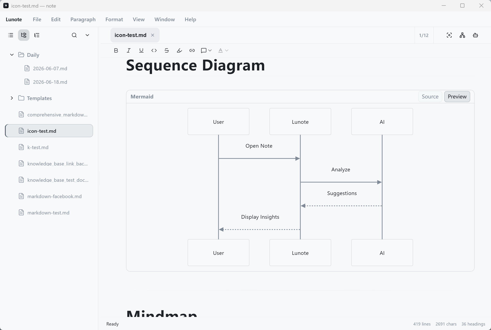
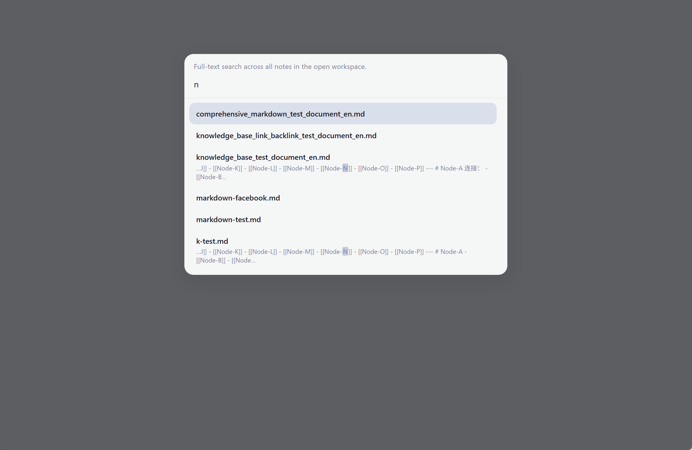
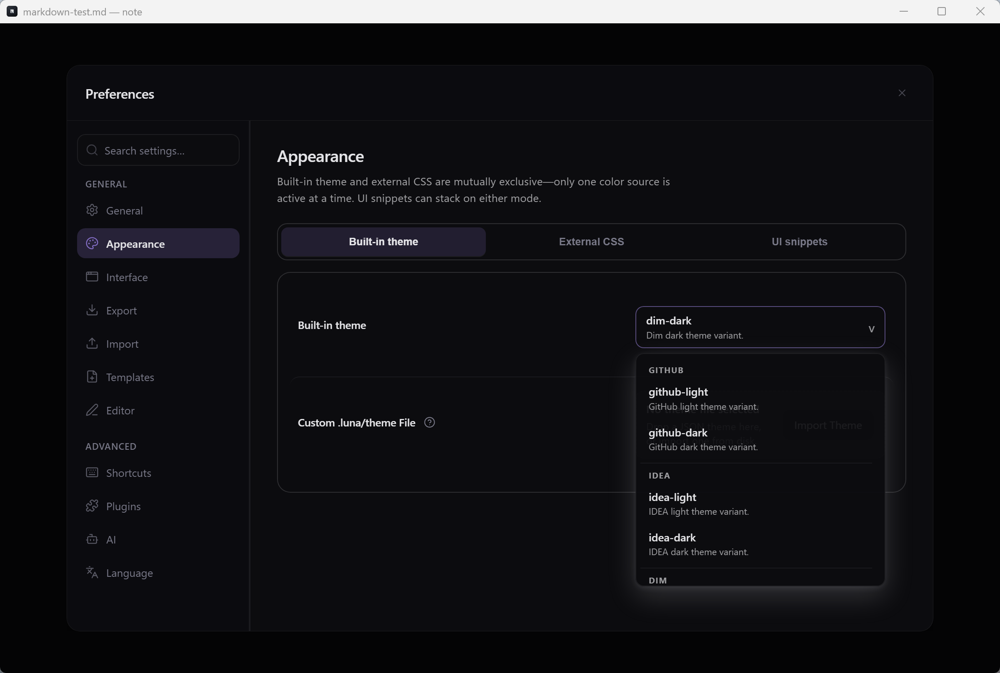

  

<h1 align="center">Lunote</h1>

  <strong>AI でつながる知識体系を構築する。</strong> 
  <em>Lunote は Markdown ノート、Wiki リンク、ナレッジグラフの可視化、AI による知識発見を組み合わせ、思考・学習・創作をより効果的にします。</em> 
  <em>散らばったノートをつながった知識へ — local-first、任意の AES-256 ワークスペース暗号化、データは完全にあなたの管理下。</em>

  <strong>macOS</strong>、<strong>Windows</strong>、<strong>Linux</strong> 対応。

  
  
  
  
  

<h3 align=
>
  <a href=
>選ぶ理由</a> &nbsp;|&nbsp;
  <a href=
>機能</a> &nbsp;|&nbsp;
  <a href=
>はじめに</a> &nbsp;|&nbsp;
  <a href=
>ダウンロード</a> &nbsp;|&nbsp;
  <a href=
>貢献</a>
</h3>

  <strong>ドキュメント：</strong> <a href="README.md">全言語</a> · <a href="../README.md">English</a>

  <strong>翻訳：</strong>
  <a href="../README.md">🇬🇧</a>
  <a href="README.zh-CN.md">🇨🇳</a>
  <a href="README.zh-TW.md">🇹🇼</a>
  <a href="README.ko.md">🇰🇷</a>
  <a href="README.de.md">🇩🇪</a>
  <a href="README.fr.md">🇫🇷</a>
  <a href="README.es.md">🇪🇸</a>
  <a href="README.pt.md">🇵🇹</a>
  <a href="README.it.md">🇮🇹</a>
  <a href="README.ru.md">🇷🇺</a>

  <strong>ガイド：</strong> <a href="guide/themes.md">テーマ</a> · <a href="guide/shortcuts-and-menus.md">ショートカットと / コマンド</a> · <a href="guide/README.md">ガイド一覧</a>

  
  
  

  <a href="#preview">スクリーンショット</a> · <a href="#why-lunote">理由</a> · <a href="#key-features">機能</a> · <a href="#compare">比較</a> · <a href="#download">ダウンロード</a> · <a href="#getting-started">クイックスタート</a> · <a href="#faq">FAQ</a>

<!-- readme-demo-gif -->

  

つながる知識 · `[[Wiki リンク]]` · AI 発見 · グラフ · local-first · 任意の暗号化

---

Lunote は **AI ネイティブの知識管理ワークスペース** — 個人のナレッジベースとして、アイデアがつながり、成長し、AI が本当に理解できるものになります。任意の `.md` フォルダを開き、ノートの山ではなくシステムを構築しましょう。

| | |
|---|---|
| **Platforms** | macOS, Windows, Linux |
| **UI languages** | English, 简体中文, 繁體中文, 日本語, 한국어, Deutsch, Français, Español, Русский, Português (Brasil), Italiano |
| **Export** | PDF, Word (DOCX), HTML, PNG · print |
| **Security** | Optional workspace encryption (AES-256-GCM) · passwords never saved on disk |

**v1.0.4**：ワークスペースを開いたときに読み込みオーバーレイで止まらないようにしました。ビジュアルエディタは TipTap 3.23.1 のままです（3.30/3.31 では編集が壊れます）。

---

## Lunote を選ぶ理由

多くのノートアプリは情報の**記録**には向いていますが、**知識の構築**までは助けてくれません。

- **普通のノートはサイロになりがち** — フォルダに溜まっても関係が見えない。
- **つながりが知識を複利化する** — Wiki リンク、バックリンク、関連ノートがネットワークになる。
- **AI はナレッジベース全体を理解すべき** — 開いている文書だけでなく。ワークスペースの文脈で総合・リンク提案・ギャップ発見ができる。
- **ノートを保存時暗号化できる** — 任意の AES-256-GCM ワークスペース暗号化で Markdown を保護；セッションごとにパスワードで解除；パスワードはディスクに保存されません。

Lunote はそのために：**local-first の個人ナレッジベース**で、**任意のワークスペース暗号化**により、つながる思考と AI 理解が協働 — クラウド拘束、アカウント、プラグインの山なし。
---

## 主な機能

<!-- readme-body-start -->

### AI 駆動のナレッジベース

ノートを理解し協働する AI — 横に付いたチャットではありません。

- **ワークスペース対応の会話** — 現在のノート、選択、`@` 言及、リンク近傍、ワークスペース検索の文脈
- **AI 検索** — 質問時に Vault 全体から関連スニペットを取得
- **要約と統合** — ノート・選択・テーマを要点に凝縮
- **執筆支援** — 続き、書き換え、翻訳、Lunote Markdown での構造化
- **知識統合** — ノート横断分析、ワークスペース概要、テーマ単位の洞察

**環境設定 → AI** で API キーを設定（OpenAI、Anthropic、Google、DeepSeek、OpenRouter、Ollama など）。

### つながる知識

アイデア間の関係を築く — 生きた知識システムの基盤。

- **Wiki リンク** — `[[ノートをリンク]]`；リネームで Vault 内リンクを更新
- **バックリンク** — 現在のノートへの参照を表示
- **関連ノート** — 文脈を失わずスレッドをたどる
- **双方向リンク** — 自動で両方向に機能

### 知識発見

ワークスペース全体で関連アイデア、パターン、隠れたつながりを見つける。

- **リンク提案** — 既存ノートに基づく `[[Wiki リンク]]` の提案
- **関係の発見** — トピックのクラスタと関連性
- **トピック探索** — 既知・不足・次に書くべきこと
- **不足リンクの検出** — ギャップ、孤立、リンク不足

### ナレッジグラフの可視化

グラフは **知識ネットワークのビュー** — 今考えていることの周辺のつながり。

- 開いているノート中心の **ローカルサブグラフ** — 深さとフィルター
- **接続でナビゲート** — グラフからリンクノートへ
- **知識の成長を見る** — リンクが増えるとクラスタが形成

> 既定はアクティブノート周辺の **ローカルサブグラフ**。**グローバル** または全画面でワークスペース全体のリンクグラフを表示。性能上限：**拡張**（既定）400 ノード / 700 エッジ、**標準** 250 / 400、**コンパクト** 120 / 200 — Obsidian のような無制限 Vault グラフではありません。

### Markdown ネイティブ

オープンで移植性の高い将来志向の形式。

- **Markdown ファースト** — ビジュアル／ソース、集中モード
- **オープン形式** — ディスク上の plain `.md`、独自 DB なし
- **移植可能** — Obsidian、Typora など同じフォルダを開ける
- **リッチコンテンツ** — コード、表、数式、Mermaid、コールアウト；PDF/Word/HTML/PNG 出力

### ワークスペース暗号化

保存時の機密ノートを保護 — 内蔵、プラグイン不要。

- **AES-256-GCM** — Markdown ノート本文をディスク上で暗号化
- **セッションごとのパスワード** — ワークスペースを開くときに解除；ディスクに保存されません
- **ワークスペースごとに任意** — **環境設定 → セキュリティ** で有効化
- **画像は任意** — 添付は既定で平文；**画像を暗号化** で一般的な画像（PNG、JPEG、WebP、GIF、HEIC、SVG など）を暗号化
- **アイドル自動ロック** — 無操作後（既定 5 分）に保存してから、解除済みの暗号化ワークスペースをロック。未保存の汚れが残る場合はロックをスキップ

### Local First

知識はあなたの管理下に。

- **データはあなたのもの** — マシン上のワークスペースフォルダ
- **ワークスペースベース** — 任意の Vault；Git、Syncthing、iCloud で同期
- **プライバシー** — オフライン優先、アカウント不要；設定した AI のみ
- **必要なら暗号化** — 上記 **ワークスペース暗号化** を参照；パスワードはディスクに保存されません
- **軽量** — コア知識ツール内蔵；[テーマパック](https://github.com/lunote-code/lunote-theme) は任意

### 生産性の基本

- タブ、アウトライン、コマンドパレット（`Cmd+Shift+P`）、ノートごとのスナップショット
- 全体検索（`Cmd+Shift+F` / `Ctrl+Shift+F`）、`/` メニュー
- ライト/ダーク、**環境設定 → プラグイン** の任意パック

<!-- readme-body-end -->

---

## スクリーンショット

  

AI + コード表示 — ワークスペース連動の執筆

  

ナレッジグラフ — つながるアイデアを探索

### その他

| AI アシスタント | コード編集 | ソース表示 |
| :---: | :---: | :---: |
|  |  |  |

| Mermaid 図 | 全体検索 | テーマ設定 |
| :---: | :---: | :---: |
|  |  |  |

---

## はじめに

1. **[ダウンロード](#download)** から macOS / Windows / Linux 版をインストール。
2. **ワークスペースを開く** — Obsidian Vault、Notion エクスポート、Typora フォルダ、任意の `.md` フォルダ。インポート不要。
3. **つながりを作る** — `[[` でリンク；バックリンクと現在ノート周辺のグラフを確認。
4. **AI を有効化** — **環境設定 → AI** で API キーを追加し、ノートまたはワークスペース全体について質問。
5. **発見と成長** — AI リンク提案、ワークスペース概要、検索でパターンとギャップを見つける。
6. **任意：ワークスペースを暗号化** — **環境設定 → セキュリティ** でワークスペース暗号化を有効にし、Markdown ノートを保存時に保護。開くたびにパスワードを入力。必要なら **画像を暗号化** とアイドル自動ロックも設定。

> **ツール移行？** ファイルはそのまま。どの Markdown アプリも同じフォルダを読めます。

---

## ダウンロード

**[最新版をダウンロード →](https://github.com/lunote-code/lunote/releases)**

登録不要 · ローカル `.md` のみ · オフライン可 · **任意のワークスペース暗号化**

<strong>macOS 初回起動（Gatekeeper）</strong>

1. **Lunote** を **アプリケーション** に移動
2. **右クリック → 開く → 開く**
3. 必要なら `xattr -cr /Applications/Lunote.app`

| プラットフォーム | パッケージ |
|---|---|
| macOS (Apple Silicon) | `.dmg` (arm64) |
| Windows (x86_64) | `.msi` (x64) |
| Windows (ARM64) | `.msi` (arm64) |
| Linux (Debian/Ubuntu) | `.deb`（任意で `.deb.asc`） |

---

## Lunote vs Notion vs Obsidian

| | Notion | Obsidian | Lunote |
|---|---|---|---|
| **データ** | クラウドアカウント | ローカル `.md` | ローカル `.md` |
| **知識モデル** | ワークスペース内ページ | Vault + プラグイン | つながるワークスペース、内蔵 |
| **AI** | 相手データ上のクラウド AI | プラグイン依存 | ワークスペース対応 AI（自分の API キー） |
| **Wiki リンクとグラフ** | 基本 | Vault 全体グラフ（多くはプラグイン） | **ローカルサブグラフ** + 発見、内蔵 |
| **最初のノートまで** | 登録してから執筆 | プラグイン調整（任意） | フォルダを開く → アイデアをつなぐ |
| **ワークスペース暗号化** | なし | プラグイン / OS | **内蔵**（AES-256-GCM、任意） |
| **オフラインとプライバシー** | 一部 | 完全オフライン | 完全オフライン、アカウント不要 |

---

## ユースケース

- **個人ナレッジベース** — Wiki リンク、バックリンク、AI 統合でセカンドブレインを育てる
- **研究と学習** — 読書、要約、洞察をテーマ横断でつなぐ
- **開発者ドキュメント** — ADR、ランブック、スニペット；コードブロックと PDF 出力
- **Notion / Obsidian からの移行** — 同じ Markdown フォルダ、手間少なく、アップロードなし
- **機密ノートと日記** — 任意のワークスペース暗号化で Markdown 本文を保護
- **チーム非同期ドキュメント** — Git でワークスペース共有；全員が plain `.md` を保持

---

## ロードマップ

Lunote はより深い **AI ネイティブ知識管理** 体験へ進化中。方向性：

- より豊かな **知識発見** — より賢いリンク提案、トピックマップ、ギャップ検出
- より深い **AI ワークスペース理解** — より良い文脈、統合、ノート横断推論
- 拡張された **グラフ可視化** — 知識のつながりを探る方法の追加
- 継続的な **local-first** の磨き込み — 性能、エクスポート、クロスプラットフォーム信頼性

進捗とアイデアは [GitHub Discussions](https://github.com/lunote-code/lunote/discussions) と [Issues](https://github.com/lunote-code/lunote/issues) へ。

---

## GitHub で Lunote に Star

つながる知識の構築に Lunote が役立ったら、**[リポジトリに Star](https://github.com/lunote-code/lunote)** を — AI 駆動の個人ナレッジベースを探す人の助けになります。アイデアは [Discussions](https://github.com/lunote-code/lunote/discussions) へ。

---

## ユーザーガイド（英語）

英語のハウツー（テーマ、ショートカット、完全な **`/`** スラッシュコマンド一覧）：

- [テーマ](guide/themes.md) — 内蔵テーマ、Theme フォルダ、外部 CSS、スニペット、エクスポート、**環境設定 → プラグイン**
- [ショートカットとクイックメニュー](guide/shortcuts-and-menus.md) — コマンドパレット、キーボードショートカット、**`/`** コマンド一覧
- [ワークスペース暗号化](guide/workspace-encryption.md) — AES-256-GCM、任意の画像暗号化、アイドル自動ロック
- [ナレッジグラフ](guide/knowledge-graph.md) — ローカルサブグラフ、グローバル／全画面、性能上限
- [プラットフォーム差異](guide/platform-differences.md) — PDF、印刷、ファイルマネージャで表示、OS 別の注意
- [ガイド索引](guide/README.md) — 全ガイドページ

---

## 開発

自分で Lunote をビルドする場合：

- **前提：** Node.js、Rust、[Tauri](https://tauri.app/) プラットフォームツール
- **開発：** `npm install` の後 `npm run tauri:dev`
- **バンドル：** `npm run tauri:bundle`（または `tauri:bundle:dmg` / `msi` / `deb`）
- **ドキュメント：** [ドキュメント索引](README.md) · [パッケージング](packaging-strategy.md) · [スクリプト](../scripts/README.md)

質問は [Issue を開く](https://github.com/lunote-code/lunote/issues)。PR 歓迎。

---

## 貢献

プルリクエストの前に：

- [スクリプトとメンテナンス](../scripts/README.md) でロケールとリリース手順を確認
- エディタやエクスポート変更時は `npm run lint` と関連テストを実行
- [多言語 README](README.md) でメッセージを一貫させる

アイデアと移行ストーリー：[Discussions](https://github.com/lunote-code/lunote/discussions) · [Issues](https://github.com/lunote-code/lunote/issues)

## FAQ

**アカウントやインターネットは必要？**  
不要。Lunote はオフライン優先。ノートはローカルに留まり、フォルダは自分で同期。AI は API キーと利用時のネットワークが必要。

**Lunote は AI ノートアプリ？Markdown エディタ？**  
Lunote は **個人ナレッジベース** — Markdown が保存形式、AI がワークスペースを理解可能・発見可能にする。エディタは知識システムに奉仕する。

**Obsidian Vault を開ける？**  
はい。同じフォルダを指定するだけ。移行不要。

**Obsidian や Notion を完全に置き換える？**  
必ずしも。Lunote はつながる知識、ワークスペース対応 AI、local-first デスクトップに焦点。モバイルや大型プラグインが必要なら併用を。

**Obsidian の Vault 全体グラフと同じ？**  
部分的です。Lunote の既定は開いているノート中心の **ローカルサブグラフ**。ナレッジレールで **グローバル** または全画面に切り替えます（上限：既定 **拡張** 400 ノード / 700 エッジ、**標準** 250 / 400、**コンパクト** 120 / 200）。Obsidian のような無制限 Vault グラフではありません。

**AI はノートをどう使う？**  
文脈は現在ノート、選択、`@` 言及、リンク近傍、検索スニペット — 会話で送る内容のみ。**環境設定 → AI** でプロバイダーを設定。

**ワークスペースを暗号化できますか？**  
はい。**環境設定 → セキュリティ** で任意の **ワークスペース暗号化** を有効にできます。Markdown ノートは暗号化して保存され、開くたびにパスワードが必要です。画像は **画像を暗号化** をオンにするまで平文です。**アイドル自動ロック** は無操作後に解除済みセッションをロックできます。パスワードはメモリ内のみ — 紛失すると復元できません。

**プラグインはある？**  
テーマのみ — **環境設定 → プラグイン** で [lunote-theme](https://github.com/lunote-code/lunote-theme) の任意パック。Wiki リンク、グラフ、AI、エクスポートはインストール不要。

**フィードバックは？**  
[Issue](https://github.com/lunote-code/lunote/issues) または [Discussion](https://github.com/lunote-code/lunote/discussions)。

---

## ライセンス

オープンソースソフトウェア。条項はリポジトリのライセンスファイルを参照。

---
