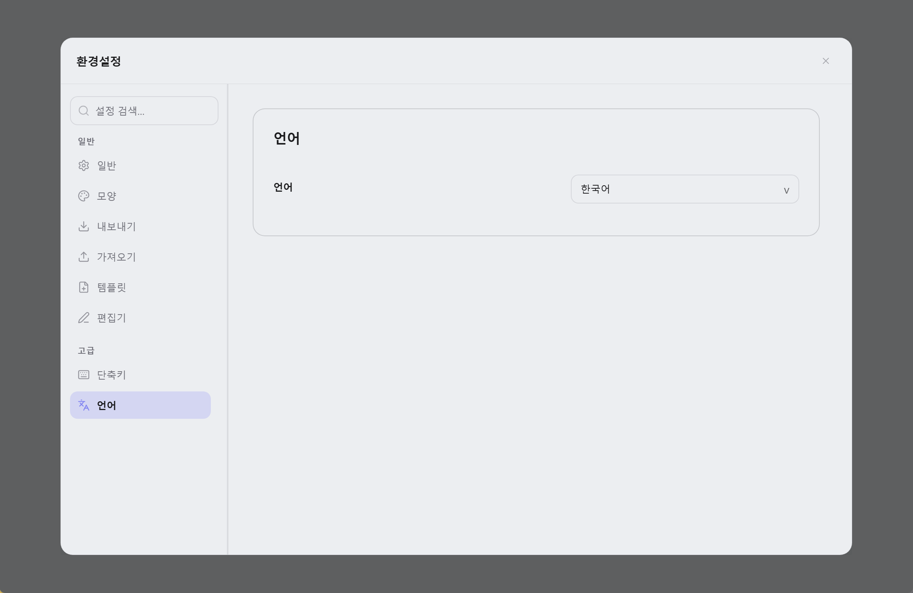

  

<h1 align="center">Lunote</h1>

  <strong>Markdown 폴더를 열면 됩니다—작성, 연결, 지식 그래프. 내장 기능과 선택적 테마 플러그인.</strong> 
  <em>무료·오픈소스·오프라인. 모든 노트는 디스크의 <code>.md</code> 파일입니다.</em> 
  <em>노트는 내 컴퓨터에만 있습니다. 계정·업로드 없음—Git, Syncthing, iCloud 등으로 폴더를 직접 동기화.</em>

  <strong>macOS</strong>, <strong>Windows</strong>, <strong>Linux</strong> 지원.

  
  
  
  

<h3 align="center">
  <a href="#preview">스크린샷</a> &nbsp;|&nbsp;
  <a href="#overview">Lunote란</a> &nbsp;|&nbsp;
  <a href="#capabilities">기능</a> &nbsp;|&nbsp;
  <a href="#download">다운로드</a> &nbsp;|&nbsp;
  <a href="#development">개발</a> &nbsp;|&nbsp;
  <a href="#contribution">기여</a>
</h3>

  <strong>Docs:</strong> <a href="README.md">All languages</a> · <a href="../README.md">English</a>

  <strong>번역:</strong>
  <a href="../README.md">🇬🇧</a>
  <a href="README.zh-CN.md">🇨🇳</a>
  <a href="README.zh-TW.md">🇹🇼</a>
  <a href="README.ja.md">🇯🇵</a>
  <a href="README.de.md">🇩🇪</a>
  <a href="README.fr.md">🇫🇷</a>
  <a href="README.es.md">🇪🇸</a>
  <a href="README.pt.md">🇵🇹</a>
  <a href="README.it.md">🇮🇹</a>
  <a href="README.ru.md">🇷🇺</a>

  <strong>가이드(영문):</strong> <a href="guide/themes.md">테마</a> · <a href="guide/shortcuts-and-menus.md">단축키 & <code>/</code> 명령</a> · <a href="guide/README.md">목록</a>

  <strong>Typora 스타일 작성 + Obsidian 스타일 링크 — 내장, 테마 플러그인 카탈로그 포함.</strong>

  
  
  

  <a href="#preview">스크린샷</a> · <a href="#overview">Lunote란</a> · <a href="#capabilities">기능</a> · <a href="#download">다운로드</a> · <a href="#quick-start">빠른 시작</a> · <a href="#user-guide">가이드</a> · <a href="#faq">FAQ</a>

<!-- readme-demo-gif -->

  

작성 · `[[위키 링크]]` · 백링크 · 그래프 ·보내기 · 테마 · 플러그인

---

## 스크린샷

  

| 코드 편집 | 소스 보기 | 지식 그래프 |
| :---: | :---: | :---: |
|  |  |  |

| 전역 검색 | 기록 스냅샷 | 테마 설정 |
| :---: | :---: | :---: |
|  |  |  |

---

<!-- readme-body-start -->

## Lunote란

Lunote는 macOS, Windows, Linux용 **로컬 우선** Markdown 노트 앱입니다. **`.md` 폴더**를 작업 공간으로 열어 글을 쓰고, `[[위키 링크]]`로 노트를 연결하며, 백링크와 지식 그래프를 탐색할 수 있습니다—**계정 불필요**; **환경설정 → 플러그인**에서 테마 팩을 선택적으로 설치할 수 있습니다.

- 원하는 **`.md` 폴더**를 워크스페이스로
- **비주얼·소스** 단축키 전환
- 내장 **위키 링크**, 백링크, 그래프, 아웃라인, 검색
- **환경설정 → 플러그인**: [lunote-theme](https://github.com/lunote-code/lunote-theme) 카탈로그에서 테마 팩(CSS, 스니펫, 토큰) 탐색·설치

| | |
|---|---|
| **플랫폼** | macOS, Windows, Linux |
| **UI 언어** | English, 简体中文, 繁體中文, 日本語, 한국어, Deutsch, Français, Español, Русский, Português (Brasil), Italiano |
| **보내기** | PDF, Word (DOCX), HTML, PNG · print |

---

## 핵심 기능

워크플로에 맞게 선택하세요—아래 기능은 Lunote에 기본 포함됩니다:

### 작성

*에세이, 문서, 일기—서식 보기와 Markdown 소스 전환.*

- 비주얼 + **Markdown 소스**; `Cmd+/` / `Ctrl+/`
- **`/` 메뉴**: 제목, 표, Mermaid, 위키 링크
- 표, 수식, 이미지, **집중 모드**, 명령 팔레트
- **코드 블록**: 줄 번호, 구문 강조, 언어 선택, 접기, 복사
- **서식 도구 모음**(콜아웃, 색상 등); **파일 → 환경설정 → 타이포그래피**에서 숨기기
- **읽기 열 너비**, 글꼴, 크기를 **환경설정 → 타이포그래피**에서 조정

### 연결

*두 번째 뇌: `[[링크]]`, 백링크, 그래프—핵심 기능 내장.*

- `[[위키 링크]]` 자동 완성
- **지식 패널**: 백링크, 로컬 그래프, 임베드, 태그, **YAML frontmatter**
- 이름 변경 시 `[[링크]]` 갱신

### 정리

*보관함이 커질 때: 탭, 아웃라인, 전체 검색.*

- 파일 트리, 탭, **전역 검색**
- **아웃라인**·외부 변경 감지
- 저장, 충돌, 파일 관리자에서 표시

### 보내기·테마

*공유·인쇄: PDF, Word, HTML—테마와 선택적 플러그인 팩.*

- **PDF, HTML, DOCX, PNG**, **인쇄**
- 테마, **Theme 폴더**, 외부 CSS
- 비주얼 모드와 미리보기용 **읽기 열 너비** (좁음 / 표준 / 넓음)
- **환경설정 → 플러그인**: [lunote-theme](https://github.com/lunote-code/lunote-theme) 카탈로그에서 테마 팩 설치

### 기록

*과감한 편집—스냅샷으로 디스크에 쓰기 전 미리보기.*

- **스냅샷**; 저장 전까지 디스크 덮어쓰지 않는 복원

<!-- readme-body-end -->

---

## 다운로드

**[최신 버전 다운로드 →](https://github.com/lunote-code/lunote/releases)**

가입 불필요 · 로컬 `.md`만 · 오프라인 사용

<strong>macOS 첫 실행 (Gatekeeper)</strong>

1. **Lunote**를 **응용 프로그램**으로 이동
2. **우클릭 → 열기 → 열기**
3. 필요 시 `xattr -cr /Applications/Lunote.app`

| Platform | Package |
|---|---|
| macOS (Apple Silicon) | `.dmg` (arm64) |
| Windows (x86_64) | `.msi` (x64) |
| Windows (ARM64) | `.msi` (arm64) |
| Linux (Debian/Ubuntu) | `.deb` (+ optional `.deb.asc`) |

---

## 빠른 시작

1. **[다운로드](#download)**에서 설치.
2. **기존 보관함 열기**—Obsidian, Logseq, Typora 또는 `.md` 폴더. 가져오기 없음.
3. 작성, `[[`로 연결, `Cmd+Shift+F` / `Ctrl+Shift+F`로 검색, 필요 시 PDF/Word로보내기.

> **이전 중?** 파일은 그대로입니다. 다른 도구도 같은 Markdown을 읽습니다.

---

## Lunote를 쓰는 이유

- **내 파일**: 내가 관리하는 폴더의 `.md`.
- **앱 하나로**: 편한 작성 + 위키 링크·그래프 내장—선택적 테마 팩.

---

## 비교

Typora나 Obsidian을 쓰시나요? **편한 작성과 위키 링크를 한 데스크톱 앱에서** 원하는 분께 Lunote. 테마 카탈로그는 선택 사항입니다.

| | Typora | Obsidian | Lunote |
|---|---|---|---|
| **작성** | 매우 좋음 | 좋음 | 매우 좋음·내장 |
| **위키 링크·그래프** | 제한적 | 강함(플러그인 많음) | 강함·내장 |
| **시작 시 플러그인** | 적음 | 많음 | **선택**（테마 카탈로그） |

## Lunote를 쓰는 이유

- **내 파일**: 내가 관리하는 폴더의 `.md`.
- **앱 하나로**: 편한 작성 + 위키 링크·그래프 내장—선택적 테마 팩.

---

## 비교

Typora나 Obsidian을 쓰시나요? **편한 작성과 위키 링크를 한 데스크톱 앱에서** 원하는 분께 Lunote. 테마 카탈로그는 선택 사항입니다.

| | Typora | Obsidian | Lunote |
|---|---|---|---|
| **작성** | 매우 좋음 | 좋음 | 매우 좋음·내장 |
| **위키 링크·그래프** | 제한적 | 강함(플러그인 많음) | 강함·내장 |
| **시작 시 플러그인** | 적음 | 많음 | **선택**（테마 카탈로그） |

## 가이드(영문)

영문 사용 가이드(테마, 단축키, **`/`** 슬래시 명령 전체 목록):

- [테마](guide/themes.md) — 내장 테마, Theme 폴더, 외부 CSS, 스니펫,보내기 스타일, **환경설정 → 플러그인** 카탈로그
- [단축키 및 빠른 메뉴](guide/shortcuts-and-menus.md) — Command Palette, keyboard shortcuts, full **`/`** slash command list
- [플랫폼 차이](guide/platform-differences.md) — OS별 PDF, 인쇄, 파일 관리자에서 표시, 문제 해결
- [가이드 목록](guide/README.md) — all guide pages

---

## 개발

직접 Lunote 빌드:

- **환경:** Node.js, Rust, [Tauri](https://tauri.app/) 플랫폼 도구
- **개발:** `npm install` 후 `npm run tauri:dev`
- **빌드:** `npm run tauri:bundle` (또는 `tauri:bundle:dmg` / `msi` / `deb`)
- **문서:** [문서 색인](README.md) · [패키징](packaging-strategy.md) · [스크립트](../scripts/README.md)

문의: [Issue 열기](https://github.com/lunote-code/lunote/issues). PR 환영합니다.

---

## 기여

Pull request 전:

- [스크립트 및 유지보수](../scripts/README.md) (로케일·릴리스) 읽기
- 에디터·보내기 변경 시 `npm run lint` 및 관련 테스트 실행
- 문구는 [다국어 README](README.md)와 맞추기

아이디어: [Discussions](https://github.com/lunote-code/lunote/discussions) · [Issues](https://github.com/lunote-code/lunote/issues)

## FAQ

**계정·인터넷이 필요한가요?**  
아니요. 오프라인 가능. 폴더를 직접 동기화하지 않는 한 로컬에만 있습니다.

**Obsidian/Typora 폴더를 열 수 있나요?**  
네. 워크스페이스로 폴더를 열면 됩니다—같은 `.md`.

**Obsidian과 함께 쓸 수 있나요?**  
네. 같은 폴더를 가리킬 수 있습니다. 데이터를 잠그지 않습니다.

**Obsidian/Notion을 완전히 대체하나요?**  
항상은 아닙니다. 데스크톱 작성과 내장 링크에 집중.

**피드백은?**  
[Issue](https://github.com/lunote-code/lunote/issues) 또는 [Discussion](https://github.com/lunote-code/lunote/discussions).

---

## 라이선스

오픈 소스 소프트웨어. 약관은 저장소의 라이선스 파일을 참조하세요.

---
