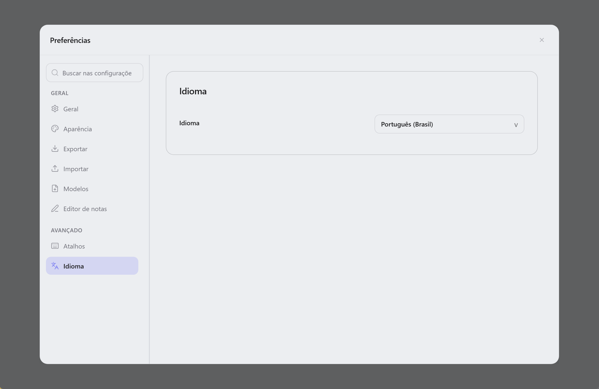

  

<h1 align="center">Lunote</h1>

  <strong>Abra sua pasta Markdown—escreva, ligue e explore um grafo. Ferramentas integradas e plugins de tema opcionais.</strong> 
  <em>Grátis, código aberto, offline. Cada nota é um <code>.md</code> no disco.</em> 
  <em>As notas ficam no seu computador. Sem conta nem envio—sincronize a pasta você mesmo (Git, Syncthing, iCloud, etc.).</em>

  Disponível para <strong>macOS</strong>, <strong>Windows</strong> e <strong>Linux</strong>.

  
  
  
  

<h3 align="center">
  <a href="#preview">Captura</a> &nbsp;|&nbsp;
  <a href="#overview">Visão geral</a> &nbsp;|&nbsp;
  <a href="#capabilities">Recursos</a> &nbsp;|&nbsp;
  <a href="#download">Download</a> &nbsp;|&nbsp;
  <a href="#development">Desenvolvimento</a> &nbsp;|&nbsp;
  <a href="#contribution">Contribuição</a>
</h3>

  <strong>Docs:</strong> <a href="README.md">All languages</a> · <a href="../README.md">English</a>

  <strong>Traduções:</strong>
  <a href="../README.md">🇬🇧</a>
  <a href="README.zh-CN.md">🇨🇳</a>
  <a href="README.zh-TW.md">🇹🇼</a>
  <a href="README.ja.md">🇯🇵</a>
  <a href="README.ko.md">🇰🇷</a>
  <a href="README.de.md">🇩🇪</a>
  <a href="README.fr.md">🇫🇷</a>
  <a href="README.es.md">🇪🇸</a>
  <a href="README.it.md">🇮🇹</a>
  <a href="README.ru.md">🇷🇺</a>

  <strong>Guia (inglês):</strong> <a href="guide/themes.md">Temas</a> · <a href="guide/shortcuts-and-menus.md">Atalhos & comandos <code>/</code></a> · <a href="guide/README.md">Índice</a>

  <strong>Escrita estilo Typora + links estilo Obsidian — integrado, com catálogo de plugins de tema.</strong>

  
  
  

  <a href="#preview">Captura</a> · <a href="#overview">Visão geral</a> · <a href="#capabilities">Recursos</a> · <a href="#download">Download</a> · <a href="#quick-start">Início rápido</a> · <a href="#user-guide">Guia</a> · <a href="#faq">FAQ</a>

<!-- readme-demo-gif -->

  

Escrever · `[[links wiki]]` · backlinks · grafo · exportar · temas · plugins

---

## Captura

  

| Editor de código | Visualização de código-fonte | Grafo de conhecimento |
| :---: | :---: | :---: |
|  |  |  |

| Pesquisa global | Instantâneos do histórico | Configurações de tema |
| :---: | :---: | :---: |
|  |  |  |

---

<!-- readme-body-start -->

## Visão geral

Abra uma pasta de **arquivos `.md`** e escreva. Lunote traz `[[links wiki]]`, backlinks e grafo—**sem conta; packs de tema opcionais em Preferências → Plugins**.

- Abra uma **pasta `.md`**
- **Visual e fonte** com um atalho
- **Links wiki**, backlinks, grafo, esboço e busca integrados
- **Preferências → Plugins**: explorar packs de tema (CSS, snippets, tokens) do catálogo [lunote-theme](https://github.com/lunote-code/lunote-theme)

| | |
|---|---|
| **Plataformas** | macOS, Windows, Linux |
| **Idiomas da interface** | English, 简体中文, 繁體中文, 日本語, 한국어, Deutsch, Français, Español, Русский, Português (Brasil), Italiano |
| **Exportar** | PDF, Word (DOCX), HTML, PNG · print |

---

## Recursos

Escolha seu fluxo—tudo abaixo já vem no app:

### Escrever

*Ensaios, docs e notas diárias—texto formatado ou Markdown bruto.*

- Editor visual e **fonte Markdown**; `Cmd+/` / `Ctrl+/`
- Menu **`/`** para blocos, tabelas, Mermaid, links wiki
- Tabelas, matemática, imagens, **modo foco**, paleta de comandos
- **Blocos de código** com números de linha, realce, idioma, recolher e copiar
- **Barra de formatação** (callouts, cores, etc.); ocultar em **Arquivo → Preferências → Tipografia**
- **Largura da coluna**, fonte e tamanho em **Preferências → Tipografia**

### Ligar

*Segundo cérebro: `[[links]]`, backlinks e grafo—integrados.*

- `[[links wiki]]` com autocompletar
- **Painel de conhecimento**: backlinks, grafo local, incorporações, tags e **frontmatter YAML**
- Renomear atualiza os `[[links]]`

### Organizar

*Quando o cofre cresce: abas, outline e busca em todas as notas.*

- Árvore de arquivos, abas, **busca global**
- **Esboço** e mudanças externas
- Salvar, conflitos, revelar no gerenciador

### Exportar e tema

*Compartilhar ou imprimir: PDF, Word, HTML—temas e packs opcionais.*

- **PDF, HTML, DOCX, PNG** e **impressão**
- Temas, pasta **Theme**, CSS externo
- Predefinições de **largura da coluna** (Estreita / Padrão / Larga) no modo visual e na pré-visualização
- **Preferências → Plugins**: instalar packs do catálogo [lunote-theme](https://github.com/lunote-code/lunote-theme)

### Histórico

*Edite com confiança—snapshots mostram antes de gravar no disco.*

- **Instantâneos**; restaurar sem sobrescrever até salvar

<!-- readme-body-end -->

---

## Download

**[Baixar última versão →](https://github.com/lunote-code/lunote/releases)**

Sem cadastro · só `.md` locais · funciona offline

<strong>Primeira abertura no macOS (Gatekeeper)</strong>

1. Mover **Lunote** para **Aplicativos**
2. **Clique direito → Abrir → Abrir**
3. Se precisar: `xattr -cr /Applications/Lunote.app`

| Platform | Package |
|---|---|
| macOS (Apple Silicon) | `.dmg` (arm64) |
| Windows (x86_64) | `.msi` (x64) |
| Windows (ARM64) | `.msi` (arm64) |
| Linux (Debian/Ubuntu) | `.deb` (+ optional `.deb.asc`) |

---

## Início rápido

1. Instale pelo **[Download](#download)**.
2. **Abra seu cofre existente**—Obsidian, Logseq, Typora ou qualquer pasta `.md`. Sem importar.
3. Escreva, use `[[` para ligar, `Cmd+Shift+F` / `Ctrl+Shift+F` para buscar, exporte para PDF ou Word quando quiser.

> **Migrando?** Os arquivos ficam no lugar. Outras ferramentas leem o mesmo Markdown.

---

## Por que Lunote

- **Seus arquivos**: `.md` normais em pastas que você controla.
- **Um app só**: boa escrita, links wiki e grafo integrados—packs opcionais.

---

## Comparação

Usa Typora ou Obsidian? Lunote é para quem quer **escrita confortável e links wiki em um app desktop**, com catálogo de temas opcional.

| | Typora | Obsidian | Lunote |
|---|---|---|---|
| **Escrita** | Excelente | Boa | Excelente, integrada |
| **Links wiki e grafo** | Limitado | Forte (muitos plugins) | Forte, integrado |
| **Plugins para começar** | Poucos | Muitos | **Opcionais** (catálogo) |

## Guia (inglês)

Guias em inglês (temas, atalhos e a lista completa de comandos **`/`**):

- [Temas](guide/themes.md) — temas integrados, pasta Theme, CSS externo, snippets, estilos de exportação, catálogo **Preferências → Plugins**
- [Atalhos e menus rápidos](guide/shortcuts-and-menus.md) — Command Palette, keyboard shortcuts, full **`/`** slash command list
- [Diferenças por plataforma](guide/platform-differences.md) — PDF, impressão, revelar no gerenciador de arquivos e solução de problemas por SO
- [Índice do guia](guide/README.md) — all guide pages

---

## Desenvolvimento

Compilar o Lunote você mesmo:

- **Pré-requisitos:** Node.js, Rust e ferramentas [Tauri](https://tauri.app/)
- **Dev:** `npm install` e depois `npm run tauri:dev`
- **Build:** `npm run tauri:bundle` (ou `tauri:bundle:dmg` / `msi` / `deb`)
- **Documentação:** [Índice da documentação](README.md) · [Packaging](packaging-strategy.md) · [Scripts](../scripts/README.md)

Dúvidas? [Abrir issue](https://github.com/lunote-code/lunote/issues). PRs bem-vindos.

---

## Contribuição

Antes de um pull request:

- Ler [Scripts e manutenção](../scripts/README.md) (locales e releases)
- Executar `npm run lint` e testes relevantes ao alterar editor ou exportação
- Manter textos alinhados nos [READMEs localizados](README.md)

Ideias: [Discussions](https://github.com/lunote-code/lunote/discussions) · [Issues](https://github.com/lunote-code/lunote/issues)

## Desenvolvimento

Compilar o Lunote você mesmo:

- **Pré-requisitos:** Node.js, Rust e ferramentas [Tauri](https://tauri.app/)
- **Dev:** `npm install` e depois `npm run tauri:dev`
- **Build:** `npm run tauri:bundle` (ou `tauri:bundle:dmg` / `msi` / `deb`)
- **Documentação:** [Índice da documentação](README.md) · [Packaging](packaging-strategy.md) · [Scripts](../scripts/README.md)

Dúvidas? [Abrir issue](https://github.com/lunote-code/lunote/issues). PRs bem-vindos.

---

## Contribuição

Antes de um pull request:

- Ler [Scripts e manutenção](../scripts/README.md) (locales e releases)
- Executar `npm run lint` e testes relevantes ao alterar editor ou exportação
- Manter textos alinhados nos [READMEs localizados](README.md)

Ideias: [Discussions](https://github.com/lunote-code/lunote/discussions) · [Issues](https://github.com/lunote-code/lunote/issues)

## Desenvolvimento

Compilar o Lunote você mesmo:

- **Pré-requisitos:** Node.js, Rust e ferramentas [Tauri](https://tauri.app/)
- **Dev:** `npm install` e depois `npm run tauri:dev`
- **Build:** `npm run tauri:bundle` (ou `tauri:bundle:dmg` / `msi` / `deb`)
- **Documentação:** [Índice da documentação](README.md) · [Packaging](packaging-strategy.md) · [Scripts](../scripts/README.md)

Dúvidas? [Abrir issue](https://github.com/lunote-code/lunote/issues). PRs bem-vindos.

---

## Contribuição

Antes de um pull request:

- Ler [Scripts e manutenção](../scripts/README.md) (locales e releases)
- Executar `npm run lint` e testes relevantes ao alterar editor ou exportação
- Manter textos alinhados nos [READMEs localizados](README.md)

Ideias: [Discussions](https://github.com/lunote-code/lunote/discussions) · [Issues](https://github.com/lunote-code/lunote/issues)

## FAQ

**Precisa de conta ou internet?**  
Não. Funciona offline; notas locais até você sincronizar a pasta.

**Abrir pasta do Obsidian ou Typora?**  
Sim. Abra como workspace—os mesmos `.md`.

**Usar junto com o Obsidian?**  
Sim. A mesma pasta para ambos. Lunote não trava seus dados.

**Substitui Obsidian ou Notion?**  
Nem sempre. Foco: escrita no desktop + links integrados.

**Feedback?**  
[Abrir issue](https://github.com/lunote-code/lunote/issues) ou [discussion](https://github.com/lunote-code/lunote/discussions).

---

## Licença

Software de código aberto. Consulte o arquivo de licença do repositório.

---
