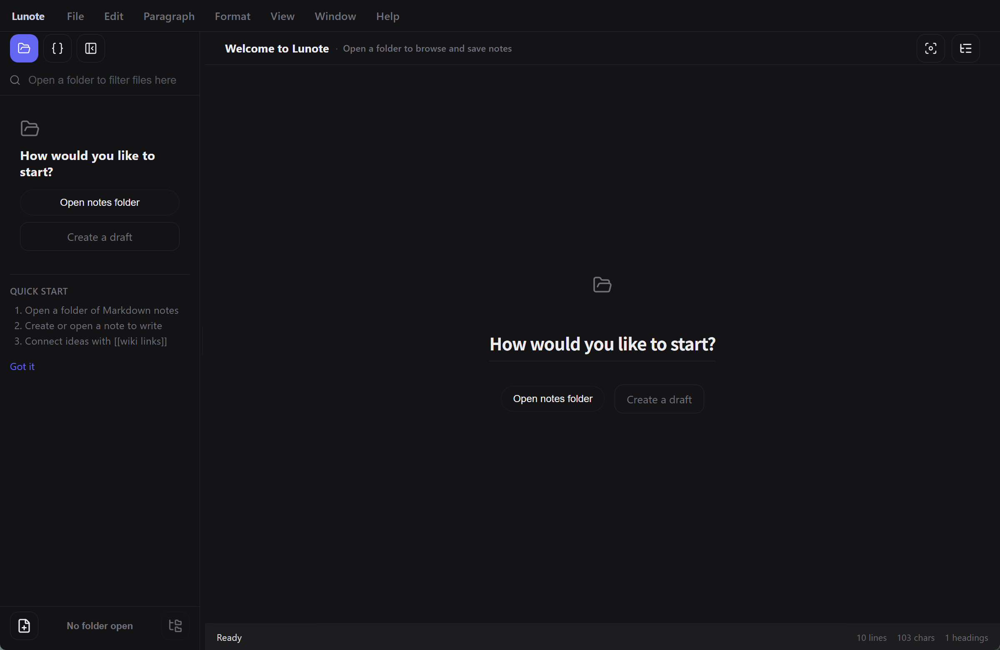

  

<h1 align="center">Lunote</h1>

  <strong>Откройте папку Markdown—пишите, связывайте, исследуйте граф знаний. Без плагинов.</strong> 
  <em>Бесплатно, open source, офлайн. Каждая заметка — файл <code>.md</code> на диске.</em> 
  <em>Заметки остаются на вашем компьютере. Без аккаунта и загрузки—синхронизируйте папку сами (Git, Syncthing, iCloud и т. п.).</em>

  Доступно для <strong>macOS</strong>, <strong>Windows</strong> и <strong>Linux</strong>.

  
  
  
  

<h3 align="center">
  <a href="#preview">Скриншот</a> &nbsp;|&nbsp;
  <a href="#overview">О проекте</a> &nbsp;|&nbsp;
  <a href="#capabilities">Возможности</a> &nbsp;|&nbsp;
  <a href="#download">Скачать</a> &nbsp;|&nbsp;
  <a href="#development">Разработка</a> &nbsp;|&nbsp;
  <a href="#contribution">Участие</a>
</h3>

  <strong>Docs:</strong> <a href="README.md">All languages</a> · <a href="../README.md">English</a>

  <strong>Переводы:</strong>
  <a href="../README.md">🇬🇧</a>
  <a href="README.zh-CN.md">🇨🇳</a>
  <a href="README.zh-TW.md">🇹🇼</a>
  <a href="README.ja.md">🇯🇵</a>
  <a href="README.ko.md">🇰🇷</a>
  <a href="README.de.md">🇩🇪</a>
  <a href="README.fr.md">🇫🇷</a>
  <a href="README.es.md">🇪🇸</a>
  <a href="README.pt.md">🇵🇹</a>
  <a href="README.it.md">🇮🇹</a>

  <strong>Руководство (англ.):</strong> <a href="guide/themes.md">Темы</a> · <a href="guide/shortcuts-and-menus.md">Горячие клавиши и <code>/</code></a> · <a href="guide/README.md">Оглавление</a>

  <strong>Письмо в духе Typora + связи в духе Obsidian — встроено.</strong>

  
  
  

  <a href="#preview">Скриншот</a> · <a href="#overview">О проекте</a> · <a href="#capabilities">Возможности</a> · <a href="#download">Скачать</a> · <a href="#quick-start">Быстрый старт</a> · <a href="#user-guide">Руководство</a> · <a href="#faq">FAQ</a>

<!-- readme-demo-gif -->

  

Письмо · `[[wiki‑ссылки]]` · обратные ссылки · граф · экспорт · темы

---

## Скриншот

  

| Редактор кода | Граф знаний | Глобальный поиск |
| :---: | :---: | :---: |
|  |  |  |

| Снимки истории | Настройки темы |
| :---: | :---: |
|  |  |

### Другие превью тем

Доп. скриншоты: `assets/screenshots/theme/`. Готовые CSS, JSON-токены и сниппеты: **[Примеры тем](theme-example/README.md)**.

| GitHub Light | GitHub Dark | IDEA Light | IDEA Dark | Dim Light |
| :---: | :---: | :---: | :---: | :---: |
|  |  |  |  |  |

| Dim Dark | Forest Dawn | Ember Glow | Graphite Noir | Lavender Haze |
| :---: | :---: | :---: | :---: | :---: |
|  |  |  |  |  |

---

<!-- readme-body-start -->

## Обзор

Откройте папку с **файлами `.md`** и пишите. Lunote добавляет `[[wiki‑ссылки]]`, обратные ссылки и граф—**без аккаунта и магазина плагинов**.

- Откройте **папку `.md`** как workspace
- **Визуальный и исходный** режим по горячей клавише
- Встроенные **wiki‑ссылки**, обратные ссылки, граф, структура и поиск

| | |
|---|---|
| **Платформы** | macOS, Windows, Linux |
| **Языки интерфейса** | English, 简体中文, 繁體中文, 日本語, 한국어, Deutsch, Français, Español, Русский, Português (Brasil), Italiano |
| **Экспорт** | PDF, Word (DOCX), HTML, PNG · print |

---

## Возможности

Выберите свой сценарий—всё ниже уже в приложении:

### Письмо

*Эссе, документы, дневник—форматированный текст или сырой Markdown.*

- Визуальный редактор и **исходник**; `Cmd+/` / `Ctrl+/`
- Меню **`/`**: заголовки, таблицы, Mermaid, wiki‑ссылки
- Таблицы, формулы, **фокус**, палитра команд
- **Блоки кода**: номера строк, подсветка, язык, сворачивание и копирование
- **Панель форматирования** (callout, цвета и т.д.); скрыть в **Файл → Настройки → Типографика**
- **Ширина колонки**, шрифт и размер в **Настройки → Типографика**

### Связи

*Второй мозг: `[[ссылки]]`, обратные ссылки и граф без плагинов.*

- `[[wiki‑ссылки]]` с автодополнением
- **Панель знаний**: обратные ссылки, локальный граф, встраивания, теги и **YAML frontmatter**
- Переименование обновляет `[[ссылки]]`

### Порядок

*Когда хранилище растёт: вкладки, ежедневные заметки, структура и поиск по всем заметкам.*

- Дерево файлов, вкладки, **глобальный поиск**
- **Структура** и внешние изменения
- Сохранение, конфликты, показать в проводнике
- **Ежедневные заметки**: сегодня, вчера или завтра—из шаблона (`Cmd+Shift+D` / `Ctrl+Shift+D`)
- **Шаблоны заметок** с переменными (`{{date:…}}`, `{{title}}`, …) в **Файл → Шаблоны**
- **Быстрый захват**: системный трей + глобальное сочетание открывают сегодняшнюю заметку в фоне

### Экспорт и темы

*Поделиться или печать: PDF, Word, HTML—и темы под вашим контролем.*

- **PDF, HTML, DOCX, PNG**, **печать**
- Темы, папка **Theme**, внешний CSS
- Пресеты **ширины колонки** (Узкая / Стандарт / Широкая) для визуального режима и предпросмотра

### История

*Смелые правки—снимки показывают превью до записи на диск.*

- **Снимки**; восстановление без перезаписи до сохранения

<!-- readme-body-end -->

---

## Скачать

**[Скачать последний релиз →](https://github.com/lunote-code/lunote/releases)**

Без регистрации · только локальные `.md` · работает офлайн

<strong>Первый запуск macOS (Gatekeeper)</strong>

1. Переместите **Lunote** в **Программы**
2. **ПКМ → Открыть → Открыть**
3. При необходимости: `xattr -cr /Applications/Lunote.app`

| Platform | Package |
|---|---|
| macOS (Apple Silicon) | `.dmg` (arm64) |
| Windows (x86_64) | `.msi` (x64) |
| Windows (ARM64) | `.msi` (arm64) |
| Linux (Debian/Ubuntu) | `.deb` (+ optional `.deb.asc`) |

---

## Быстрый старт

1. Установите Lunote в разделе **[Скачать](#download)**.
2. **Откройте существующее хранилище**—Obsidian, Logseq, Typora или любую папку `.md`. Импорт не нужен.
3. Пишите, `[[` для ссылок, `Cmd+Shift+F` / `Ctrl+Shift+F` для поиска, экспорт в PDF или Word при необходимости.

> **Переход с другого приложения?** Файлы остаются на месте. Другие программы читают тот же Markdown.

---

## Почему Lunote

- **Ваши файлы**: обычные `.md` в ваших папках.
- **Одно приложение**: удобное письмо, wiki‑ссылки и граф встроены—без плагинов.

---

## Сравнение

Уже пользуетесь Typora или Obsidian? Lunote для тех, кому нужны **удобное письмо и wiki‑ссылки в одном десктоп‑приложении** без настройки плагинов.

| | Typora | Obsidian | Lunote |
|---|---|---|---|
| **Письмо** | Отлично | Хорошо | Отлично, встроено |
| **Wiki‑ссылки и граф** | Слабо | Сильно (часто плагины) | Сильно, встроено |
| **Плагины для старта** | Мало | Много | Не нужны |

---

## Руководство (англ.)

Пошаговые инструкции на английском (темы, сочетания клавиш и полный список команд **`/`**):

- [Темы](guide/themes.md) — built-in themes, Theme folder, external CSS, snippets, export styles
- [Горячие клавиши и меню](guide/shortcuts-and-menus.md) — Command Palette, keyboard shortcuts, full **`/`** slash command list
- [Templates](Templates/README.md) — default and daily note templates, variables
- [Различия платформ](guide/platform-differences.md) — PDF, печать, показать в файловом менеджере, заметки по ОС
- [Оглавление](guide/README.md) — all guide pages

---

## Разработка

Собрать Lunote самостоятельно:

- **Требования:** Node.js, Rust и инструменты [Tauri](https://tauri.app/)
- **Разработка:** `npm install`, затем `npm run tauri:dev`
- **Сборка:** `npm run tauri:bundle` (или `tauri:bundle:dmg` / `msi` / `deb`)
- **Документация:** [Указатель документации](README.md) · [Packaging](packaging-strategy.md) · [Скрипты](../scripts/README.md)

Вопросы: [Issue](https://github.com/lunote-code/lunote/issues). PR приветствуются.

---

## Участие

Перед pull request:

- Прочитать [Скрипты и сопровождение](../scripts/README.md) (локали и релизы)
- При изменениях редактора или экспорта — `npm run lint` и нужные тесты
- Согласовывать тексты в [локализованных README](README.md)

Идеи: [Discussions](https://github.com/lunote-code/lunote/discussions) · [Issues](https://github.com/lunote-code/lunote/issues)

---

## FAQ

**Нужен аккаунт или интернет?**  
Нет. Работает офлайн; заметки локальны, пока вы сами не синхронизируете папку.

**Открыть папку Obsidian или Typora?**  
Да. Откройте папку как workspace—те же `.md`.

**Использовать вместе с Obsidian?**  
Да. Одна папка для обоих. Lunote не блокирует данные.

**Заменяет Obsidian или Notion полностью?**  
Не всегда. Фокус: письмо на десктопе и встроенные связи.

**Сообщить об ошибке или идее?**  
[Issue](https://github.com/lunote-code/lunote/issues) или [Discussion](https://github.com/lunote-code/lunote/discussions).

---

## Лицензия

ПО с открытым исходным кодом. Условия — в файле лицензии репозитория.

## Поддержать проект

Если Lunote вам помогает, вы можете добровольно поддержать разработку через **USDT TRC20** в сети Tron.

| | |
|---|---|
| **Сеть** | Tron (TRC20) · USDT |
| **Адрес** | USDT · `TEDgPJzSmv7YTjrs2EZrFF5kCNbuZY15iY` |

Проверьте адрес перед отправкой. On-chain переводы необратимы. Поддержка добровольна и не является покупкой услуги.

---