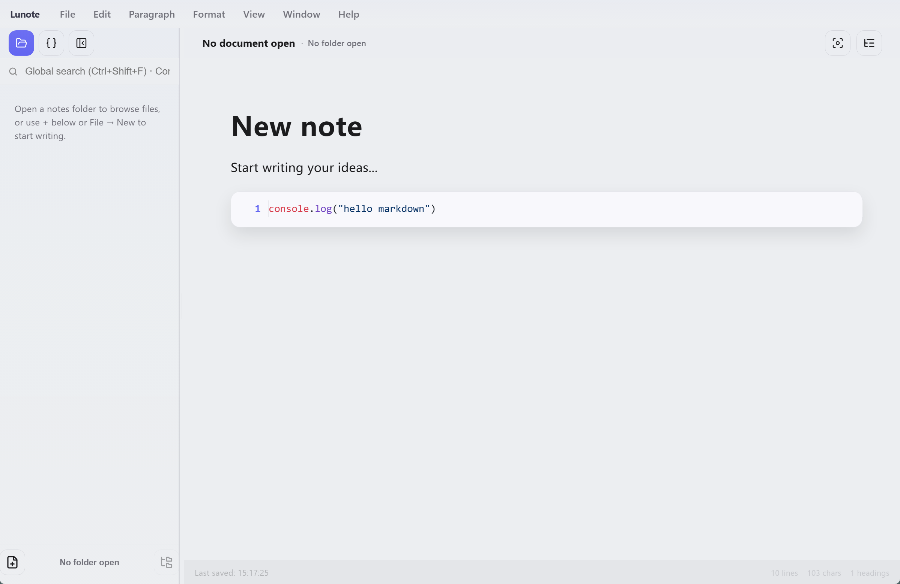
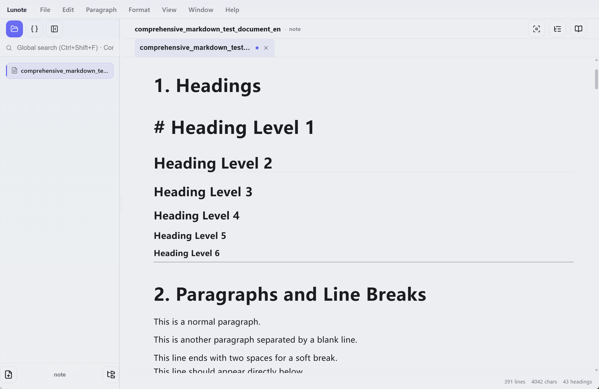
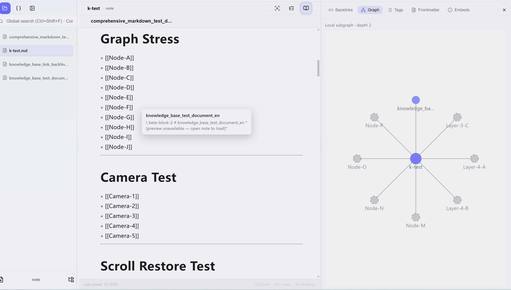
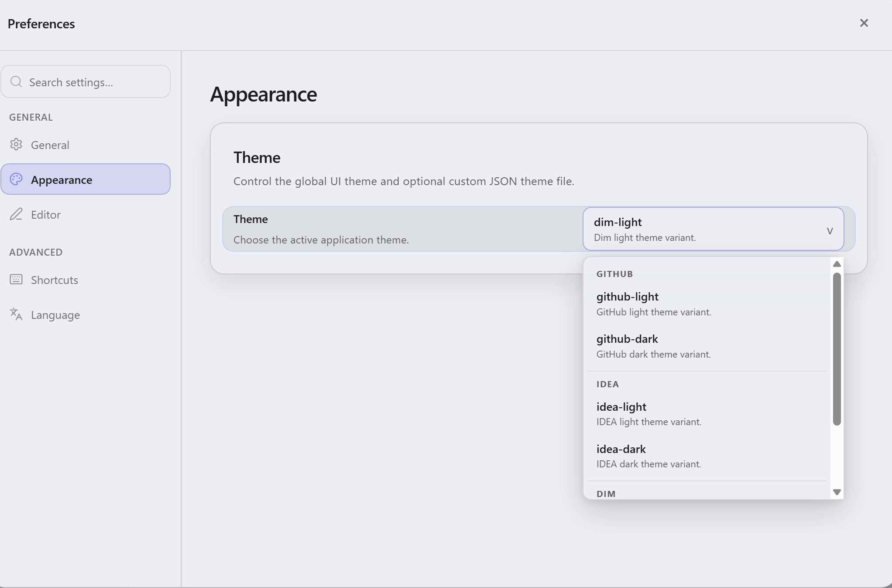

# Lunote

**一款本地优先的 Markdown 工作区，用于写作、链接与构建个人知识库**

*在精致的编辑器里写作，用 Wiki 链接连接想法，把每一篇笔记都保存在本地的 `.md` 文件中。免费、开源，专为离线工作而生。*

**Typora 式写作体验 + Obsidian 式双链知识库 — 内建能力，无需插件。**

**文档：** [全部语言](README.md) · [English](README.en.md)

**使用指南（英文）：** [主题](guide/themes.md) · [快捷键与 `/` 命令](guide/shortcuts-and-menus.md) · [目录](guide/README.md)

[预览](#preview) · [为什么选择 Lunote](#why-lunote) · [Typora vs Obsidian vs Lunote](#typora-vs-obsidian-vs-lunote) · [下载](#download) · [快速开始](#quick-start) · [使用指南](#user-guide) · [FAQ](#faq)

<!-- readme-demo-gif -->

  

10 秒速览 · 本地 Markdown · 双链 · 图谱 · 主题 · 无需插件

---

## Lunote 是什么？

Lunote 是一款桌面 Markdown 工作区，适合想同时获得这 3 点的人：

- **本地纯 Markdown 文件**
- **强大的写作体验**
- **内建的知识链接工作流**

你可以把任意文件夹直接作为工作区打开，继续使用自己掌控的普通 `.md` 文件。需要流畅写作时用可视化模式，需要精确控制时切换到 Markdown 源码模式，并直接使用 wiki 链接、反向链接、图谱和搜索，无需依赖插件。

| | |
|---|---|
| **平台** | macOS、Windows、Linux |
| **界面语言** | English, 简体中文, 繁體中文, 日本語, 한국어, Deutsch, Français, Español, Русский, Português (Brasil), Italiano |
| **导出** | PDF、Word (DOCX)、HTML、PNG |
| **技术栈** | Tauri 2 · Rust · React · TipTap · CodeMirror |

---

## 预览

  

| 可视化编辑器 | 知识图谱 | 主题 |
| :---: | :---: | :---: |
|  |  |  |

---

## 为什么选择 Lunote

- **本地优先**：你的笔记始终是你自己文件夹里的普通 Markdown 文件。
- **编辑器优先**：可视化编辑与原始 Markdown 源码都是一等能力。
- **知识工作流就绪**：wiki 链接、反向链接、图谱、大纲和搜索都内建。
- **实用**：需要时导出，用你自己的工具同步，且可离线工作。

---

## Typora vs Obsidian vs Lunote

| 对比项 | Typora | Obsidian | Lunote |
|---|---|---|---|
| **最适合谁** | 追求干净单文档写作的人 | 追求插件生态和库级定制的 PKM 用户 | 想把写作和知识链接放在同一应用里的人 |
| **编辑体验** | 极简 Markdown 编辑器 | 可扩展的 Markdown 平台 | 可视化编辑 + Markdown 源码 |
| **知识库能力** | 有限 | 强，但常依赖插件 | 内建 wiki 链接、反向链接、图谱、搜索 |
| **上手复杂度** | 低 | 中到高 | 低到中 |
| **插件依赖** | 低 | 高 | 低 |
| **适合你如果...** | 你主要想要写作工具 | 你主要想要生态和扩展性 | 你想平衡写作体验与知识工作流 |

---

## 下载

**[最新发布 →](https://github.com/lunote-code/lunote/releases)**

当前 GitHub release workflow 产出的安装包：

| 平台 | 包类型 | 工作流参考 |
|---|---|---|
| macOS (Apple Silicon) | `.dmg` (arm64) | `macos-14` |
| Windows (x86_64) | `.msi` (x64) | `windows-2022` |
| Windows (ARM64) | `.msi` (arm64) | `windows-11-arm` |
| Linux (Debian/Ubuntu) | `.deb` (+ 可选 `.deb.asc`) | `ubuntu-22.04` |

macOS 首次启动：

1. 将 **Lunote** 移动到 **Applications**
2. **右键 → 打开 → 打开**
3. 如有需要，执行 `xattr -cr /Applications/Lunote.app`

---

## 快速开始

1. 安装适合你平台的 Lunote。
2. 打开一个包含 Markdown 笔记的文件夹，或新建工作区。
3. 开始写作，用 `[[` 链接笔记，用 `Ctrl+Shift+F` / `Cmd+Shift+F` 搜索，并在需要时导出。

如果你已经有 Obsidian、Logseq 或 Typora 的 Markdown 笔记库，直接打开文件夹即可，无需导入。

---

## 使用指南（英文）

英文分步说明（主题、快捷键与完整 **`/`** 斜杠命令列表）：

- [主题](guide/themes.md) — 内置外观、Theme 文件夹、Obsidian CSS、代码片段与导出样式
- [快捷键与快捷菜单](guide/shortcuts-and-menus.md) — 命令面板、键盘快捷键与完整 **`/`** 斜杠命令列表
- [指南目录](guide/README.md) — 全部指南页面

---

## FAQ

**需要账号或联网吗？**  
不需要。Lunote 支持离线工作，除非你自己同步，否则笔记始终保存在本地。

**可以使用已有的 Markdown 库吗？**  
可以。直接打开任意包含 `.md` / `.markdown` 文件的文件夹。

**和其他工具兼容吗？**  
兼容。Lunote 使用标准 Markdown，所以同一个文件夹仍可与 Obsidian、VS Code、Typora 或 Git 一起使用。

**它能完全替代 Obsidian 或 Notion 吗？**  
Lunote 更专注于本地 Markdown、强编辑体验和内建链接能力。如果你需要移动端或大型插件生态，仍可与其他工具搭配使用。

**如何反馈 Bug 或提出功能建议？**  
你可以[提交 issue](https://github.com/lunote-code/lunote/issues)或发起[discussion](https://github.com/lunote-code/lunote/discussions)。

---

## 许可协议

这是一个开源项目。具体条款请查看仓库中的许可证文件。

---

## 支持项目

如果 Lunote 对你有帮助：

- **[给仓库点 Star](https://github.com/lunote-code/lunote)** — 帮助更多人发现这个项目
- **[参与讨论](https://github.com/lunote-code/lunote/discussions)** — 使用场景与反馈和代码一样重要

如果 Lunote 对你有帮助，欢迎通过 Tron 网络上的 **TRC20 USDT** 自愿赞助开发。

| | |
|---|---|
| **网络** | Tron（TRC20）· USDT |
| **地址** | USDT · `TEDgPJzSmv7YTjrs2EZrFF5kCNbuZY15iY` |

转账前务必核对地址。链上转账不可撤销。赞助为自愿行为，不构成服务购买。

---