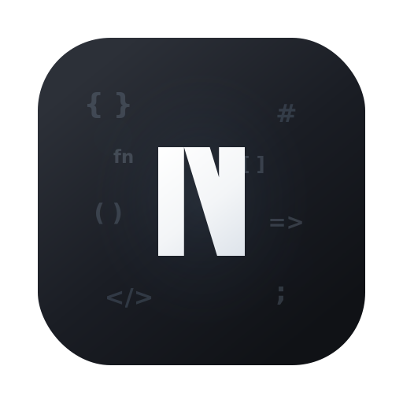
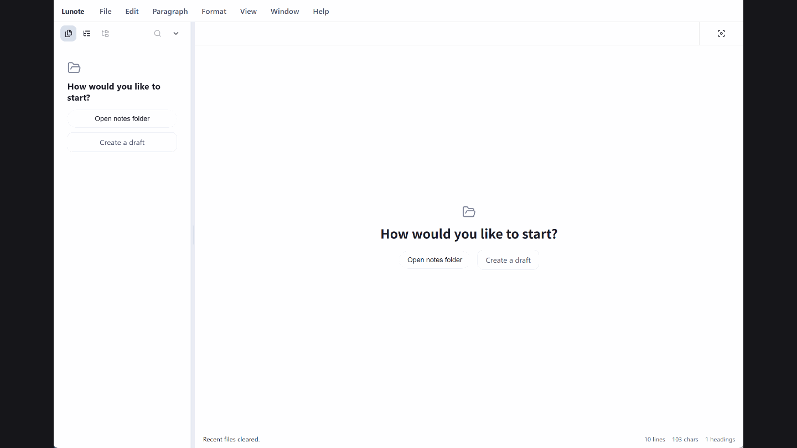
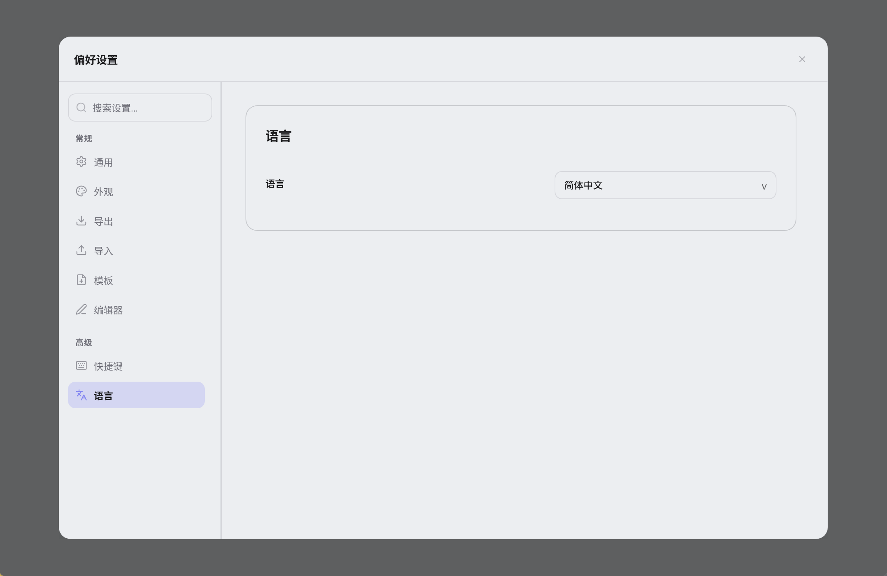
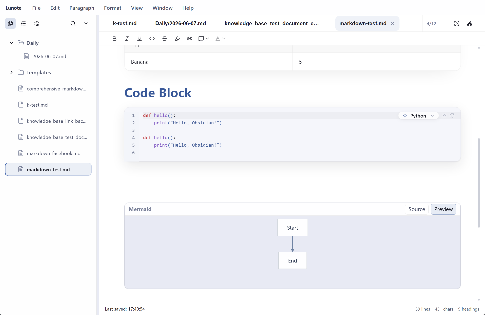
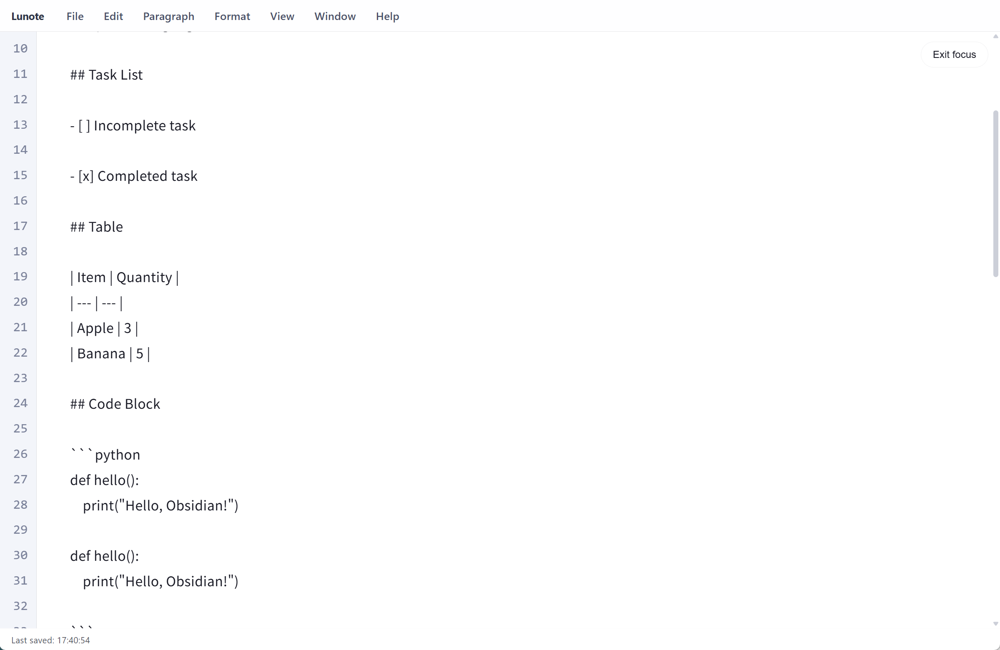
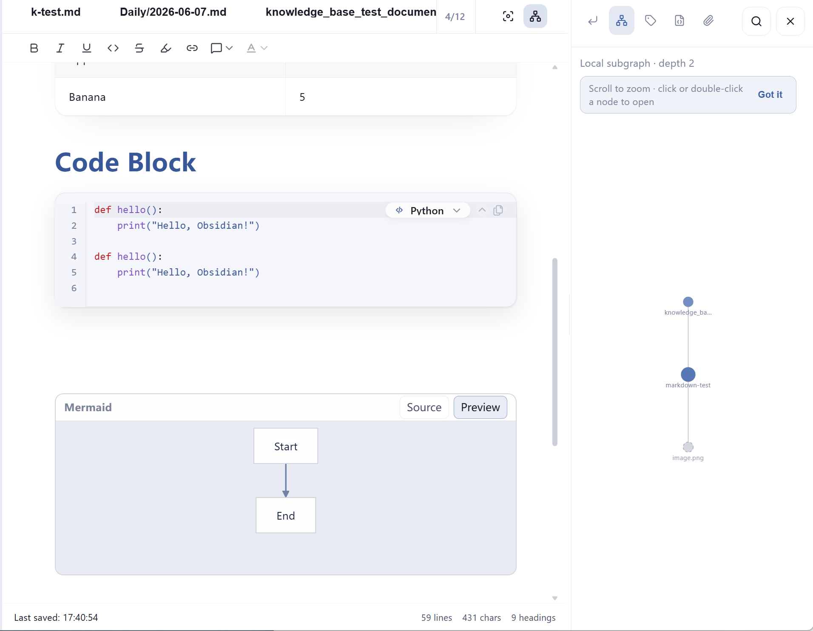
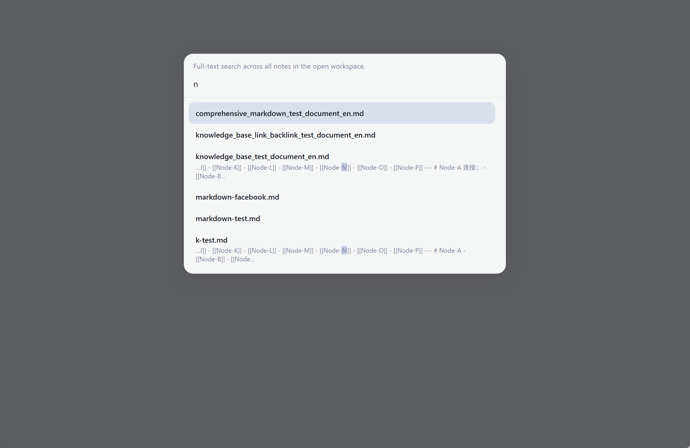
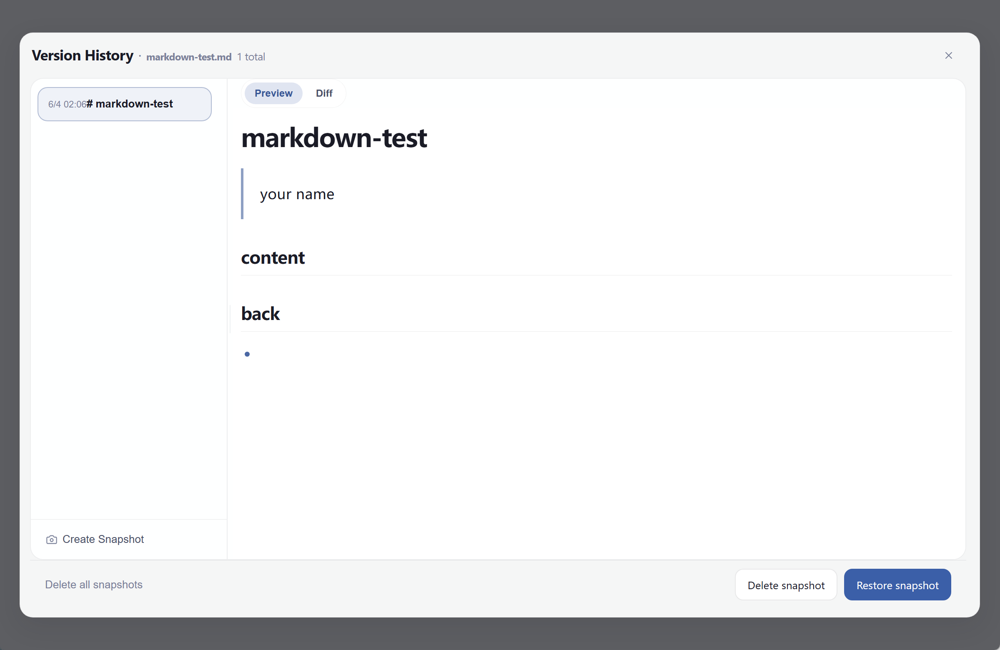
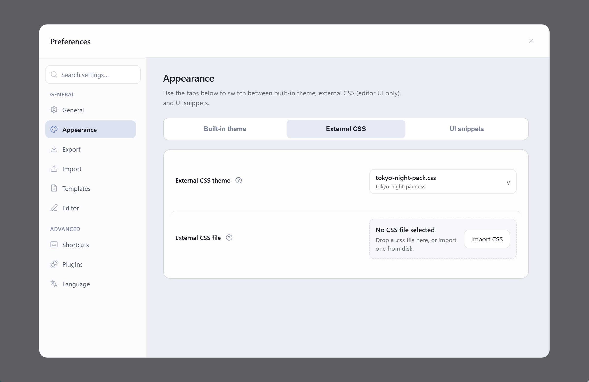

  

<h1 align="center">Lunote</h1>

  <strong>打开 Markdown 文件夹就能用——写作、双链、图谱；核心内建，还可选装主题插件。</strong> 
  <em>免费开源、可离线。每一篇笔记都是磁盘上的 <code>.md</code> 文件。</em> 
  <em>笔记只存在你的电脑上。无需账号、不上传——需要时用 Git、Syncthing、iCloud 等自行同步文件夹。</em>

  支持 <strong>macOS</strong>、<strong>Windows</strong>、<strong>Linux</strong>。

  
  
  
  

<h3 align="center">
  <a href="#preview">截图</a> &nbsp;|&nbsp;
  <a href="#overview">是什么</a> &nbsp;|&nbsp;
  <a href="#capabilities">功能</a> &nbsp;|&nbsp;
  <a href="#download">下载</a> &nbsp;|&nbsp;
  <a href="#development">开发</a> &nbsp;|&nbsp;
  <a href="#contribution">参与贡献</a>
</h3>

  <strong>文档：</strong> <a href="README.md">全部语言</a> · <a href="../README.md">English</a>

  <strong>其他语言：</strong>
  <a href="../README.md">🇬🇧</a>
  <a href="README.zh-TW.md">🇹🇼</a>
  <a href="README.ja.md">🇯🇵</a>
  <a href="README.ko.md">🇰🇷</a>
  <a href="README.de.md">🇩🇪</a>
  <a href="README.fr.md">🇫🇷</a>
  <a href="README.es.md">🇪🇸</a>
  <a href="README.pt.md">🇵🇹</a>
  <a href="README.it.md">🇮🇹</a>
  <a href="README.ru.md">🇷🇺</a>

  <strong>使用指南（英文）：</strong> <a href="guide/themes.md">主题</a> · <a href="guide/shortcuts-and-menus.md">快捷键与斜杠（/）命令</a> · <a href="guide/README.md">目录</a>

  <strong>Typora 式写作 + Obsidian 式双链 — 内建，并附带主题插件目录。</strong>

  
  
  

  <a href="#preview">截图</a> · <a href="#overview">是什么</a> · <a href="#capabilities">功能</a> · <a href="#download">下载</a> · <a href="#quick-start">快速开始</a> · <a href="#user-guide">使用指南</a> · <a href="#faq">FAQ</a>

<!-- readme-demo-gif -->

  

写作 · `[[双链]]` · 反向链接 · 图谱 · 导出 · 主题 · 插件

---

## 截图

  

| 代码编辑 | 源码视图 | 知识图谱 |
| :---: | :---: | :---: |
|  |  |  |

| 全局搜索 | 历史快照 | 主题设置 |
| :---: | :---: | :---: |
|  |  |  |

---

<!-- readme-body-start -->

## 这是什么

打开 **`.md` 文件夹**就能写。内建 `[[双链]]`、反向链接与知识图谱——**无需账号；可在偏好设置 → 插件浏览主题包**.

- 把任意 **`.md` 文件夹**当作工作区打开
- **可视化与源码**一键切换（`Cmd+/` / `Ctrl+/`）
- 内建 **双链**、反向链接、知识图谱、大纲与全文搜索
- **偏好设置 → 插件**：从 [lunote-theme](https://github.com/lunote-code/lunote-theme) 目录浏览并安装主题包（CSS、片段、令牌）

| | |
|---|---|
| **平台** | macOS、Windows、Linux |
| **界面语言** | English、简体中文、繁體中文、日本語、한국어、Deutsch、Français、Español、Русский、Português (Brasil)、Italiano |
| **导出** | PDF、Word (DOCX)、HTML、PNG · 打印 |

---

## 功能

按你的场景选用——以下能力均开箱即用：

### 写作

*长文、文档、日记：可视化与源码随时切换。*

- 可视化编辑与 **Markdown 源码**；`Cmd+/` / `Ctrl+/` 切换
- **`/` 斜杠菜单**：标题、列表、表格、代码、Mermaid、标注框、双链
- 表格、公式、图片、Mermaid、**专注模式**、命令面板（`Cmd+Shift+P`）
- **代码块**：行号、语法高亮、语言选择、折叠与一键复制
- **格式工具栏**（标注框、颜色等）；可在 **文件 → 偏好设置 → 排版** 中关闭
- 在 **偏好设置 → 排版** 中调整**阅读栏宽**、字体与字号

### 双链

*搭建第二大脑：`[[双链]]`、反向链接、图谱，核心能力内建即用。*

- `[[双链]]` 自动补全，可安全打开尚未创建的笔记
- **知识侧栏**：反向链接、本地图谱、嵌入、标签与 **YAML Frontmatter** 编辑
- 重命名或移动笔记时，自动更新文件夹内的 `[[链接]]`

### 整理

*笔记变多后：多标签、大纲、全文搜索。*

- 侧栏文件树、多标签、**全局搜索**（`Cmd+Shift+F`）
- 单篇**大纲**，并监测外部文件变更
- 保存与冲突处理，在文件管理器中显示

### 导出与外观

*分享或打印 PDF/Word/HTML，主题可自定义，也可安装插件主题包。*

- 导出 **PDF、HTML、DOCX、PNG**，支持系统**打印**
- 明暗主题、**Theme 文件夹**、外部 CSS
- 视觉模式与预览支持**阅读栏宽**预设（窄 / 标准 / 宽）
- **偏好设置 → 插件**：从 [lunote-theme](https://github.com/lunote-code/lunote-theme) 目录安装主题包

### 历史

*大胆改稿：快照可先预览，再决定是否写回磁盘。*

- 单篇笔记**快照**；恢复到编辑器，确认保存前不会覆盖磁盘

<!-- readme-body-end -->

---

## 下载

**[下载最新版本 →](https://github.com/lunote-code/lunote/releases)**

无需注册 · 本地 `.md` 文件 · 可离线使用

<strong>macOS 首次打开（Gatekeeper）</strong>

1. 将 **Lunote** 拖入 **应用程序**
2. **右键 → 打开 → 打开**
3. 若仍被拦截，在终端执行：`xattr -cr /Applications/Lunote.app`

| Platform | Package |
|---|---|
| macOS (Apple Silicon) | `.dmg` (arm64) |
| Windows (x86_64) | `.msi` (x64) |
| Windows (ARM64) | `.msi` (arm64) |
| Linux (Debian/Ubuntu) | `.deb` (+ optional `.deb.asc`) |

---

## 快速开始

1. 在[下载](#download)区安装对应平台的 Lunote。
2. **直接打开已有笔记库**——Obsidian、Logseq、Typora 或任意 `.md` 文件夹，无需导入。
3. 开始写作，输入 `[[` 建立双链，用 `Cmd+Shift+F` / `Ctrl+Shift+F` 搜索，需要时导出 PDF 或 Word。

> **从别的工具迁过来？** 文件仍在原处，随时可用 Obsidian 等继续编辑同一份 Markdown。

---

## 为什么用 Lunote

- **文件在你手里**：笔记就是你自己文件夹里的 `.md`。
- **一个应用搞定**：写作顺手，双链和图谱内建，需要时还可安装主题包。

---

## 和其他工具比

正在用 Typora 或 Obsidian？Lunote 适合想要**顺手写作 + 内建双链图谱**的人；需要更多外观时再浏览插件目录。

| | Typora | Obsidian | Lunote |
|---|---|---|---|
| **写作体验** | 很好 | 不错 | 很好，内建 |
| **双链与图谱** | 较弱 | 强（常靠插件） | 强，内建 |
| **上手要不要插件** | 很少 | 经常要 | **可选**（主题目录） |

## 使用指南（英文）

英文分步说明（主题、快捷键与完整 **`/`** 斜杠命令列表）：

- [主题](guide/themes.md) — 内置外观、Theme 文件夹、external CSS、代码片段、导出样式与**偏好设置 → 插件**目录
- [快捷键与快捷菜单](guide/shortcuts-and-menus.md) — 命令面板、键盘快捷键与完整 **`/`** 斜杠命令列表
- [平台差异](guide/platform-differences.md) — 各系统 PDF、打印、在文件管理器中显示与排错
- [指南目录](guide/README.md) — 全部指南页面

---

## 开发

自行构建 Lunote：

- **环境：** Node.js、Rust 与 [Tauri](https://tauri.app/) 平台依赖
- **开发：** `npm install` 后执行 `npm run tauri:dev`
- **打包：** `npm run tauri:bundle`（或 `tauri:bundle:dmg` / `msi` / `deb`）
- **文档：** [文档索引](README.md) · [打包说明](packaging-strategy.md) · [脚本说明](../scripts/README.md)

问题反馈：[提 Issue](https://github.com/lunote-code/lunote/issues)，欢迎 PR。

---

## 参与贡献

提交 PR 前建议：

- 阅读 [脚本与维护](../scripts/README.md) 了解多语言与发布流程
- 修改编辑器或导出相关代码时运行 `npm run lint` 与相关测试
- 调整产品文案时同步 [多语言 README](README.md)

想法与迁移经验：[讨论区](https://github.com/lunote-code/lunote/discussions) · [Issues](https://github.com/lunote-code/lunote/issues)

## 开发

自行构建 Lunote：

- **环境：** Node.js、Rust 与 [Tauri](https://tauri.app/) 平台依赖
- **开发：** `npm install` 后执行 `npm run tauri:dev`
- **打包：** `npm run tauri:bundle`（或 `tauri:bundle:dmg` / `msi` / `deb`）
- **文档：** [文档索引](README.md) · [打包说明](packaging-strategy.md) · [脚本说明](../scripts/README.md)

问题反馈：[提 Issue](https://github.com/lunote-code/lunote/issues)，欢迎 PR。

---

## 参与贡献

提交 PR 前建议：

- 阅读 [脚本与维护](../scripts/README.md) 了解多语言与发布流程
- 修改编辑器或导出相关代码时运行 `npm run lint` 与相关测试
- 调整产品文案时同步 [多语言 README](README.md)

想法与迁移经验：[讨论区](https://github.com/lunote-code/lunote/discussions) · [Issues](https://github.com/lunote-code/lunote/issues)

## 开发

自行构建 Lunote：

- **环境：** Node.js、Rust 与 [Tauri](https://tauri.app/) 平台依赖
- **开发：** `npm install` 后执行 `npm run tauri:dev`
- **打包：** `npm run tauri:bundle`（或 `tauri:bundle:dmg` / `msi` / `deb`）
- **文档：** [文档索引](README.md) · [打包说明](packaging-strategy.md) · [脚本说明](../scripts/README.md)

问题反馈：[提 Issue](https://github.com/lunote-code/lunote/issues)，欢迎 PR。

---

## 参与贡献

提交 PR 前建议：

- 阅读 [脚本与维护](../scripts/README.md) 了解多语言与发布流程
- 修改编辑器或导出相关代码时运行 `npm run lint` 与相关测试
- 调整产品文案时同步 [多语言 README](README.md)

想法与迁移经验：[讨论区](https://github.com/lunote-code/lunote/discussions) · [Issues](https://github.com/lunote-code/lunote/issues)

## 常见问题

**需要账号或联网吗？**  
不需要。可离线使用；笔记在本地，除非你自行同步文件夹（Git、Syncthing、iCloud 盘等）。

**能打开 Obsidian / Typora 的文件夹吗？**  
可以。把文件夹作为工作区打开即可，仍是同一批 `.md` 文件。

**能和 Obsidian 一起用吗？**  
可以。指向同一文件夹即可，Lunote 不会锁死你的数据。

**能完全替代 Obsidian 或 Notion 吗？**  
不一定。Lunote 侧重桌面写作与内建双链；若强依赖移动端或大型插件生态，可与其他工具搭配。

**有插件吗？**  
有——主题类插件。打开 **偏好设置 → 插件**，可从 [lunote-theme](https://github.com/lunote-code/lunote-theme) 目录浏览主题包（CSS、片段、JSON 令牌）。双链、图谱与导出无需安装插件即可使用。

**如何反馈问题或想法？**  
欢迎 [提 Issue](https://github.com/lunote-code/lunote/issues) 或参与 [讨论](https://github.com/lunote-code/lunote/discussions)——迁移经验也能帮助更多人发现 Lunote。

---

## 许可证

开源软件。条款见仓库中的许可证文件。

---
